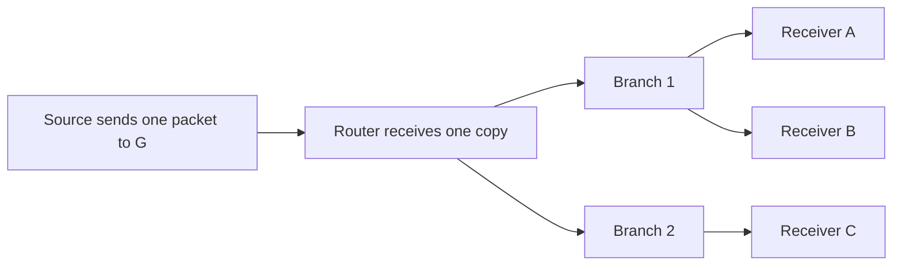

# What multicast is

[← Module index](README.md) · [↑ Multicast master index](../Multicast_Deep_Dive.md)

---

IP multicast sends one IP datagram to a **group address**. The network creates copies only where paths to interested receivers diverge. Membership is dynamic, a source does not need to be a member, and delivery remains best-effort: multicast does not inherently guarantee arrival, ordering, non-duplication, congestion control, or recovery.

The scalability benefit is that the source transmits once, common links carry one copy, and replication happens at tree branches rather than at the source for every receiver.

