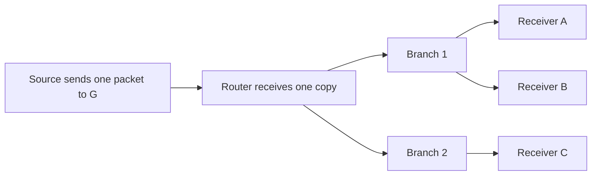

# What multicast is

**IP multicast** sends one IP datagram to a **group address**. The network creates copies only where paths to interested receivers diverge. Membership is dynamic, a source does not need to be a member, and delivery remains best-effort: multicast does not inherently guarantee arrival, ordering, non-duplication, congestion control, or recovery.


```mermaid
flowchart LR
    S["Source sends one packet to G"] --> R1["Router receives one copy"]
    R1 --> R2["Branch 1"]
    R1 --> R3["Branch 2"]
    R2 --> A["Receiver A"]
    R2 --> B["Receiver B"]
    R3 --> C["Receiver C"]
```

The scalability benefit is that the source transmits once, common links carry one copy, and replication happens at tree branches rather than at the source for every receiver.

## What multicast is not

| Expectation | Reality |
|---|---|
| Reliable like TCP | Best-effort UDP (or equivalent); apps recover gaps |
| Source knows receivers | Source knows only group, port, egress, TTL |
| One packet → one delivery | Duplicates and reordering can occur on multi-path / Assert flaps |
| “Turn on multicast” once | Host, L2, and L3 planes must all agree |

Related: [Three control planes](02_Three_Control_Planes.md), [ASM and SSM](../03_Service_Models_and_Terminology/02_ASM_and_SSM.md), [End-to-end packet path](04_End_to_End_Packet_Path.md).

## When to use it

| Fit | Why |
|---|---|
| One-to-many fan-out (market data, IPTV, discovery) | Bandwidth scales with topology, not receiver count |
| Many identical consumers of the same datagram | Single replication tree |
| Not a fit: request/response APIs | Use unicast; multicast has no per-receiver ACKs |

## Configuration patterns

Enabling multicast is never a single global knob. At minimum you choose a service model and turn on the three planes:

### Cisco IOS / IOS XE (routed SSM sketch)

```text
ip multicast-routing
ip pim ssm default
!
interface Vlan100
 ip address 192.0.2.1 255.255.255.0
 ip pim sparse-mode
!
interface Vlan200
 ip address 198.51.100.1 255.255.255.0
 ip pim sparse-mode
 ip igmp version 3
```

### Junos

```text
set routing-options multicast ssm-groups 232.0.0.0/8
set protocols pim interface vlan.100 mode sparse
set protocols pim interface vlan.200 mode sparse
set protocols igmp interface vlan.200 version 3
```

### FRRouting

```text
ip multicast-routing
!
interface vlan100
 ip pim
!
interface vlan200
 ip pim
 ip igmp
 ip igmp version 3
```

Full recipes: [PIM-SSM config](../14_Configuration_and_Observation/03_PIM_SSM_Config_Pattern.md), [PIM-SM ASM config](../14_Configuration_and_Observation/04_PIM_SM_ASM_Config_Pattern.md).

## Interactions

| Mechanism | Relationship |
|---|---|
| **IGMP/MLD** | Host ↔ first-hop membership only |
| **Snooping** | Constrains L2 flood; does not build L3 trees |
| **PIM + RPF** | Builds and validates the routed tree |
| **Application reliability** | Gap recovery / A-B feeds sit above IP multicast |

## Verification

1. Source sends one stream; capture shows one copy on the shared trunk.
2. Two receivers on different branches each receive the stream.
3. Leave one receiver; confirm that branch’s OIL shrinks without affecting the other.
4. Confirm the application still handles loss—multicast did not add reliability.

```text
show ip mroute
show ip pim neighbor
show ip igmp groups
tcpdump -ni eth0 host 232.10.10.10
```

## Risks

- Treating multicast as “broadcast that scales” and skipping RPF / boundaries.
- Expecting TCP-like semantics from a UDP market-data feed.
- Debugging only the router while the drop is on the NIC filter or snooping table.

## Interview framing

“Multicast is one-to-many IP delivery with network fan-out: the source sends once to a group, receivers signal interest, and routers replicate only at tree branches—still best-effort, still three separate control planes.”

---
