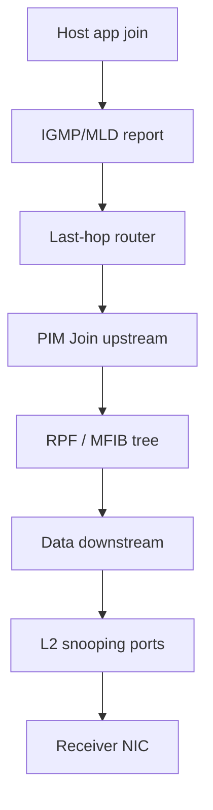

# The three multicast control planes

Every working multicast path depends on three independent control planes. Incidents persist when engineers inspect the wrong one.

| Plane | Scope | Main state | Question answered |
|---|---|---|---|
| Host membership | host to local router | IGMP (IPv4) / MLD (IPv6) | Does this local link have listeners for `G` or `(S,G)`? |
| Layer-2 replication | VLAN / bridge domain | snooping + multicast MAC table | Which switch ports should receive the frame? |
| Layer-3 tree | router to router | PIM, RPF, MRIB, RP/MSDP | Across which routed interfaces should the packet travel? |

## Hard separations

- **IGMP/MLD does not route multicast.** A successful `ip igmp join` on a host proves nothing about the core tree.
- **PIM does not tell an access switch which host port joined.** `(S,G)` OIL can be correct while the access port still floods or blackholes.
- **Snooping does not construct a routed multicast tree.** Perfect L2 tables cannot fix an RPF failure two hops away.



Related: [Receiver-driven signaling](03_Receiver_Driven_Signaling.md), [RPF check](../07_RPF_and_Forwarding/02_RPF_Check.md), [IGMP snooping complete](../06_Layer2_Snooping/06_IGMP_MLD_Snooping_Complete.md).

## Failure signature by plane

| Symptom | First plane to check |
|---|---|
| No IGMP report / wrong version | Host membership |
| Router OIL OK, host silent on access port | Layer-2 snooping / mrouter ports |
| Unicast to source works, multicast RPF fails | Layer-3 MRIB / PIM |
| Control state OK, counters flat in hardware | MFIB / replication resources |

## Configuration patterns

Each plane has its own enablement. Example last-hop VLAN with all three:

### Cisco IOS / IOS XE

```text
! L3
ip multicast-routing
interface Vlan200
 ip address 198.51.100.1 255.255.255.0
 ip pim sparse-mode
 ip igmp version 3
!
! L2 (access switch)
ip igmp snooping
ip igmp snooping vlan 200
```

### Junos

```text
set protocols pim interface irb.200 mode sparse
set protocols igmp interface irb.200 version 3
set protocols igmp-snooping vlan MD-FEED
```

### FRRouting (L3 only; snooping is on the bridge NOS)

```text
interface vlan200
 ip address 198.51.100.1/24
 ip pim
 ip igmp
 ip igmp version 3
```

L2 recipes: [L2 snooping config](../14_Configuration_and_Observation/08_L2_Snooping_Config_Patterns.md).

## Interactions

| Mechanism | Relationship |
|---|---|
| **Querier / DR** | Membership plane elects who queries; PIM elects who acts for sources |
| **mrouter ports** | Snooping must flood reports toward routers or L3 never learns joins |
| **Assert** | L3 duplicate-forwarder election on shared LANs; orthogonal to DR |
| **Static IGMP join** | Fakes membership plane; still needs L2 + L3 |

## Verification

Walk the planes in order from the receiver:

1. Host: membership visible (`ip maddr`, `netstat -g`, app logs).
2. Access switch: group present on the correct ports; mrouter port toward LHR.
3. LHR: IGMP group / SSM channel present; PIM upstream neighbor up.
4. Path: RPF interface matches data arrival; OIL reaches the receiver VLAN.
5. Capture: one clean copy at the NIC.

```text
show ip igmp groups
show ip igmp snooping groups
show ip mroute 232.10.10.10
show ip rpf 192.0.2.10
```

## Risks

- Fixing “PIM” when the access switch has no mrouter port.
- Enabling snooping without a querier (silent membership expiry).
- Assuming cloud / overlay “multicast enabled” covers all three planes.

## Interview framing

“Multicast has three control planes—membership, L2 replication, and L3 tree building—and a healthy design names which plane each symptom belongs to before changing config.”

---
