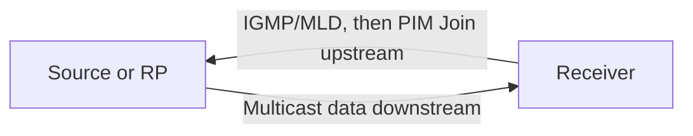

# Receiver-driven signaling and data direction

[← Module index](README.md) · [↑ Multicast master index](../Multicast_Deep_Dive.md)

---

Receiver interest and data move in opposite conceptual directions:

1. A receiver asks its kernel to join.
2. The host reports interest to a local multicast router.
3. The last-hop router adds an outgoing interface and sends PIM state upstream.
4. Data flows from the source down the constructed tree.

The source normally knows only the group, destination port, outgoing interface, and TTL/hop limit. It has no receiver list and receives no network-level acknowledgements.

