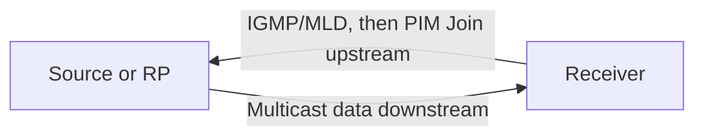
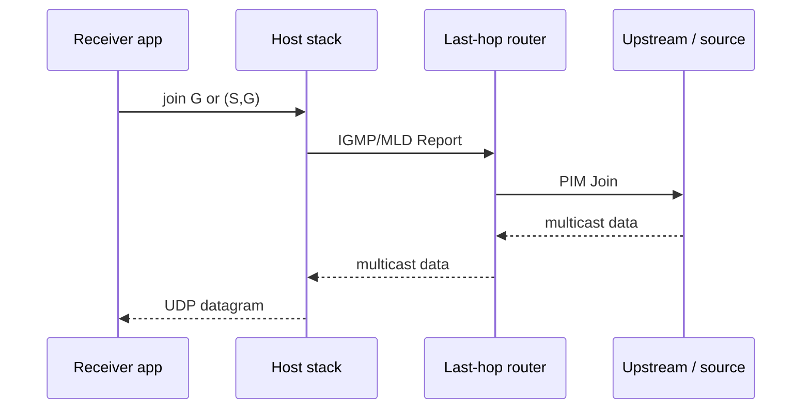

# Receiver-driven signaling and data direction

Multicast is **receiver-driven**: interest is signaled toward the source (or RP), while data flows the opposite way down the constructed tree. The source normally has no receiver list and receives no network-level acknowledgements.


```mermaid
flowchart RL
    R["Receiver"] -->|"IGMP/MLD, then PIM Join upstream"| U["Source or RP"]
    U -->|"Multicast data downstream"| R
```

## Message interaction (join path)

1. Application calls `IP_ADD_MEMBERSHIP` / `MCAST_JOIN_SOURCE_GROUP` (or equivalent).
2. Host stack emits an IGMP/MLD report on the joined interface.
3. Last-hop router (LHR) creates local OIL interest and, if needed, sends a **PIM Join** toward `S` (SSM) or the RP (ASM `(*,G)`).
4. Upstream routers install state hop-by-hop until the tree root is reached.
5. When the source (or RP) has data, packets flow **downstream** along IIF→OIL state.
6. Leave / prune reverses the interest; state times out if soft-state is not refreshed.


```mermaid
sequenceDiagram
    participant App as Receiver app
    participant Host as Host stack
    participant LHR as Last-hop router
    participant Up as Upstream / source
    App->>Host: join G or (S,G)
    Host->>LHR: IGMP/MLD Report
    LHR->>Up: PIM Join
    Up-->>LHR: multicast data
    LHR-->>Host: multicast data
    Host-->>App: UDP datagram
```

Related: [What multicast is](01_What_Multicast_Is.md), [PIM-SM complete flow](../08_PIM/03_PIM_SM_Complete_Flow.md), [IGMPv3 process](../05_IGMP_and_MLD/18_IGMPv3_Protocol_Process.md).

## Source knowledge

| Source knows | Source does not know |
|---|---|
| Group address, UDP port | Receiver IP list |
| Egress interface / VRF | Per-receiver delivery success |
| TTL / Hop Limit | Whether anyone is listening (unless app-level) |

## Configuration patterns

Receiver interest is configured on hosts and/or faked on routers for testing.

### Cisco IOS / IOS XE (static IGMP join on LHR)

```text
interface Vlan200
 ip igmp join-group 232.10.10.10 source 192.0.2.10
```

Use sparingly—static joins pull traffic even with no real host.

### Junos

```text
set protocols igmp interface irb.200 static group 232.10.10.10 source 192.0.2.10
```

### Host (Linux) — SSM join sketch

```text
# Application uses MCAST_JOIN_SOURCE_GROUP
# Inspect kernel membership:
ip maddr show
ss -uamp | grep 15000
```

See also [Python lab receiver/sender](../11_Host_and_Application/03_Python_Lab_Receiver_and_Sender.md).

## Interactions

| Mechanism | Relationship |
|---|---|
| **IGMP querier** | Keeps membership soft-state alive on the LAN |
| **PIM DR** | On multiaccess links, DR originates Registers for connected sources |
| **SPT switchover** | Receiver-driven SPT Join can prune the shared tree for `(S,G)` |
| **SSM vs ASM** | SSM Join targets `S`; ASM `(*,G)` Join targets RP |

## Verification

1. Start receiver only—confirm IGMP report and PIM Join with no data yet.
2. Start source—data appears only after upstream state exists (or Register path in ASM).
3. Stop receiver—confirm Leave/prune and OIL removal after timers.
4. Reverse order (source first): ASM uses Register; SSM waits for Join.

```text
show ip igmp groups detail
show ip mroute 232.10.10.10
show ip pim join-prune
```

## Risks

- Assuming the source “pushes” to receivers without any Join path.
- Static joins left in production that pin unwanted bandwidth.
- Debugging data direction when the Join never left the LHR (wrong VRF / missing PIM).

## Interview framing

“Interest goes up, data comes down: hosts report with IGMP/MLD, routers Join with PIM toward S or the RP, and the source never learns the receiver list from the network.”

---
