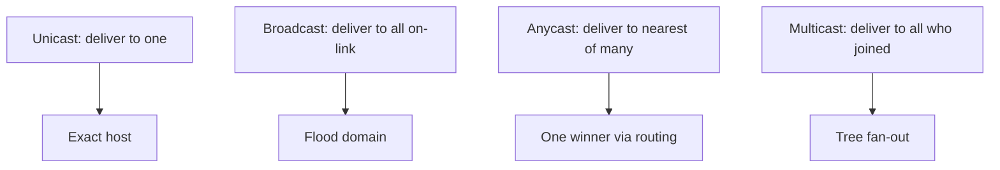

# Unicast, broadcast, anycast, and multicast

Delivery models differ by what the destination address means and how the network replicates (or selects) traffic.

| Model | Destination meaning | Replication | Common use |
|---|---|---|---|
| Unicast | one interface | one copy per destination | SSH, TCP, APIs |
| Broadcast | every node in an IPv4 broadcast domain | flooded within scope | ARP and legacy discovery |
| Anycast | one nearest member of a set | routing selects one | DNS and service front ends |
| Multicast | all subscribed group members | network fan-out along a tree | market data, IPTV, control protocols |

IPv6 has no broadcast address; multicast supplies its necessary one-to-many functions (Neighbor Discovery, Router Advertisement, and application groups).

## Mental model



Related: [What multicast is](../02_Mental_Model/01_What_Multicast_Is.md), [ASM and SSM](02_ASM_and_SSM.md).

## When each model fits

| Requirement | Prefer |
|---|---|
| Request/response, reliability, congestion control | Unicast (often TCP) |
| On-link discovery only | Broadcast (IPv4) or link-scoped multicast (IPv6) |
| Single nearest service instance | Anycast |
| Same datagram to many dynamic receivers | Multicast |

## Configuration patterns

Multicast is not “broadcast with a different address.” Enable scoped multicast rather than enlarging L2 flood domains.

### Cisco IOS / IOS XE (discourage unknown flood; require joins)

```text
ip multicast-routing
!
interface Vlan200
 ip address 198.51.100.1 255.255.255.0
 ip pim sparse-mode
 ip igmp version 3
!
! Access: snooping on; avoid treating multicast like broadcast
ip igmp snooping
```

### Junos

```text
set protocols igmp-snooping vlan ACCESS
set protocols pim interface irb.200 mode sparse
```

### FRRouting

```text
ip multicast-routing
interface vlan200
 ip pim
 ip igmp
```

## Interactions

| Mechanism | Relationship |
|---|---|
| **Anycast RP** | Anycast address selects nearest RP; MSDP/Sync shares source state |
| **L2 flood** | Broadcast-like behavior appears when snooping is off |
| **SSM** | Multicast with explicit source—closer to “known publisher” than ASM |
| **DNS anycast** | Unrelated to PIM; do not confuse service anycast with group fan-out |

## Verification

1. Unicast ping/TCP to source works (baseline reachability).
2. Multicast group join produces tree state—not a broadcast flood on unrelated ports.
3. Capture on a non-member access port: should be silent with snooping.
4. IPv6 RA/NS still work (link-local multicast), proving MLD snooping did not break ND.

```text
show ip igmp snooping groups
show ipv6 mld snooping
show ip mroute
```

## Risks

- Stretching VLANs so multicast becomes accidental broadcast.
- Using directed broadcast for application fan-out.
- Assuming anycast and multicast solve the same problem.

## Interview framing

“Unicast is one, broadcast is all on-link, anycast is nearest of many, multicast is all who subscribed—and only multicast builds a receiver-driven replication tree.”

---
