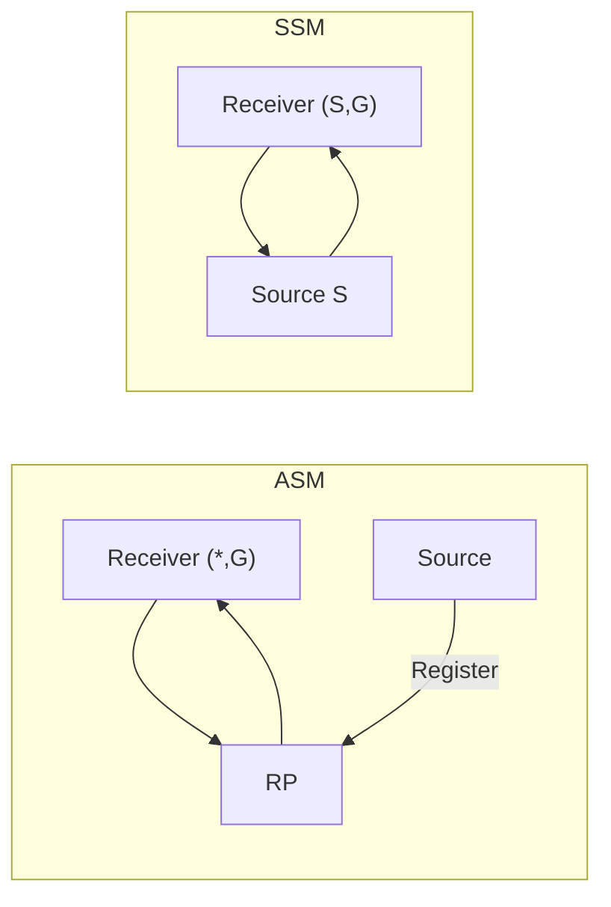

# ASM and SSM

**Any-Source Multicast (ASM)** and **Source-Specific Multicast (SSM)** are the two IP multicast service models. They differ in what the receiver asks for, how sources are discovered, and how much infrastructure (RP, Registers, MSDP) you must operate.

## Any-Source Multicast

A receiver requests group `G`, represented as `(*,G)`, and accepts traffic from **any** source. PIM Sparse Mode uses a **Rendezvous Point (RP)** so sources and receivers can meet without prior source knowledge. ASM supports many-to-many communication but adds shared-tree complexity and admits unwanted sources unless policy blocks them.

## Source-Specific Multicast

A receiver requests a channel `(S,G)`. Source discovery, RP, Registers, and MSDP are unnecessary; the tree is built directly toward `S` (RFC 4607). SSM is usually preferred when receivers can be provisioned with source addresses, as in controlled market-data plants.

| Property | ASM | SSM |
|---|---|---|
| Receiver request | `G` / `(*,G)` | `(S,G)` |
| Source discovery | RP and possibly MSDP | out-of-band configuration |
| Host signaling | IGMPv2 sufficient for group-only interest | IGMPv3 or MLDv2 source filtering |
| Tree | RPT, optionally SPT | source-rooted SPT only |
| Standard IPv4 range | often `239.0.0.0/8` (admin-scoped) | `232.0.0.0/8` |
| Complexity | higher | lower |



Related: [RP purpose](../09_Rendezvous_Point/01_RP_Purpose.md), [PIM-SSM](../08_PIM/05_PIM_SSM.md), [PIM-SM flow](../08_PIM/03_PIM_SM_Complete_Flow.md), [State notation](03_State_and_Tree_Notation.md).

## When to use which

| Scenario | Prefer |
|---|---|
| Known publishers, provisioned `(S,G)` lists | SSM |
| Ad-hoc many-to-many / unknown sources | ASM |
| Interdomain market-data style plants | SSM (or ASM only where forced) |
| Legacy IGMPv2-only receivers needing SSM | SSM mapping (see PIM-SSM page) |

## Message interaction (SSM join)

1. Host sends IGMPv3 INCLUDE `(S,G)` report.
2. LHR sends PIM `(S,G)` Join toward `S` (RPF to source).
3. Data flows down the SPT; no Register, no RP.

## Message interaction (ASM first packet)

1. Host sends IGMPv2/v3 group join → LHR PIM `(*,G)` Join toward RP.
2. Source’s FHR encapsulates first packets in **Register** to RP.
3. RP joins SPT to source / sends Register-Stop when native forwarding exists.
4. Optional SPT switchover: LHR Joins `(S,G)` toward source and prunes `(S,G,rpt)`.

## Configuration patterns

### Cisco IOS / IOS XE — SSM

```text
ip multicast-routing
ip access-list standard SSM-RANGE
 permit 232.0.0.0 0.255.255.255
ip pim ssm range SSM-RANGE
!
interface Vlan200
 ip pim sparse-mode
 ip igmp version 3
```

### Cisco IOS / IOS XE — ASM with static RP

```text
ip multicast-routing
ip pim rp-address 192.0.2.100
!
interface Loopback0
 ip address 192.0.2.100 255.255.255.255
 ip pim sparse-mode
```

### Junos — SSM

```text
set routing-options multicast ssm-groups 232.0.0.0/8
set protocols pim interface irb.200 mode sparse
set protocols igmp interface irb.200 version 3
```

### Junos — ASM static RP

```text
set protocols pim rp local address 192.0.2.100
set protocols pim rp static address 192.0.2.100
```

### FRRouting — SSM

```text
ip multicast-routing
ip pim ssm prefix-list SSM
ip prefix-list SSM permit 232.0.0.0/8
```

Full recipes: [SSM config](../14_Configuration_and_Observation/03_PIM_SSM_Config_Pattern.md), [ASM config](../14_Configuration_and_Observation/04_PIM_SM_ASM_Config_Pattern.md).

## Interactions

| Mechanism | Relationship |
|---|---|
| **IGMPv3 / MLDv2** | Required for true SSM source filters |
| **RP / BSR / Auto-RP** | ASM only |
| **MSDP / Anycast RP** | ASM interdomain / RP redundancy |
| **MBGP** | Separate multicast RPF topology for either model |
| **SSM mapping** | Translates IGMPv2 joins into `(S,G)` |

## Verification

**SSM**

1. No RP required: `show ip pim rp mapping` irrelevant for `232/8`.
2. Receiver INCLUDE → `(S,G)` state with RPF toward `S`.
3. Traffic from a second source to same `G` is ignored unless joined.

**ASM**

1. `(*,G)` RPF toward RP; Registers on FHR until Register-Stop.
2. After SPT switch, `(S,G)` present and `(S,G,rpt)` prune as expected.

```text
show ip pim rp mapping
show ip mroute 232.10.10.10
show ip mroute 239.1.1.1
show ip igmp groups detail
```

## Risks

- Putting market-data channels in ASM space and relying on “nobody will source.”
- Enabling SSM range without IGMPv3—receivers join `(*,G)` and nothing builds.
- Mixing `232/8` into RP ACL accidentally (SSM groups should not need RP).

## Interview framing

“ASM joins a group and meets sources at an RP; SSM joins a channel `(S,G)` and builds an SPT directly—prefer SSM when sources are known.”

---
