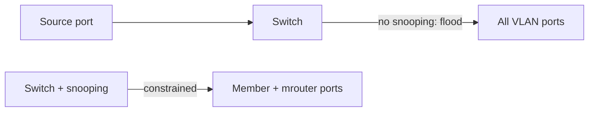

# Default Layer-2 multicast behavior

A switch can learn where unicast source MACs live, but a **multicast destination does not identify one port**. Without multicast-aware state, bridging normally **floods** multicast to eligible ports in the VLAN (excluding the ingress port).

**IGMP/MLD snooping** examines membership control packets and builds entries such as:

```text
VLAN 120, group 232.10.10.10
  receiver ports: Ethernet1/1, Ethernet1/7
  multicast-router ports: Ethernet1/48, Port-Channel10
```

Snooping is a Layer-2 **replication optimization**; it is not multicast routing. PIM still builds trees across routers.



Related: [Snooping terms](02_Snooping_Control_Terms.md), [IGMP/MLD snooping complete](06_IGMP_MLD_Snooping_Complete.md), [Three control planes](../02_Mental_Model/02_Three_Control_Planes.md).

## Flood vs constrain

| Mode | Behavior | When seen |
|---|---|---|
| No snooping | Flood to VLAN | Default on many platforms until enabled |
| Snooping + state | Forward to member + mrouter ports | Healthy L2 multicast |
| Unknown-multicast drop | Drop groups with no entry | Strict mode; can blackhole early data |
| Querier absent | State ages out → flood or drop | Common silent failure |

## Configuration patterns

### Cisco IOS / IOS XE / NX-OS-like

```text
ip igmp snooping
ip igmp snooping vlan 120
!
! Without a router, add a querier (see next pages)
ip igmp snooping querier
!
show ip igmp snooping groups vlan 120
show mac address-table multicast vlan 120
```

### Junos

```text
set protocols igmp-snooping vlan FEED-VLAN
show igmp-snooping membership vlan FEED-VLAN
```

### Linux bridge

```text
# bridge multicast snooping (kernel)
echo 1 > /sys/class/net/br0/bridge/multicast_snooping
bridge mdb show
```

Full recipes: [L2 snooping config](../14_Configuration_and_Observation/08_L2_Snooping_Configuration_Patterns.md).

## Interactions

| Mechanism | Relationship |
|---|---|
| **IGMP querier / PIM** | Provide Queries so state does not age out |
| **mrouter ports** | Must reach L3 even with no local members |
| **Storm control** | Can punish legitimate multicast floods |
| **PIM** | Unaffected by snooping except via delivery of reports |

## Verification

1. Before snooping: capture shows group on non-member access ports.
2. Enable snooping + join: only member + mrouter ports see data.
3. Leave last member: port pruned after query process (not always instantly).
4. Confirm control frames (`224.0.0.22`, queries) still reach the router.

```text
show ip igmp snooping groups
show ip igmp snooping mrouter
tcpdump -eni eth0 host 232.10.10.10
```

## Risks

- Enabling snooping without a querier → eventual blackhole.
- Unknown-multicast drop before the first report is programmed.
- Assuming snooping “turns on multicast routing.”

## Interview framing

“Without snooping a switch floods multicast in the VLAN; snooping constrains replication to member and mrouter ports—but it still needs a querier and it is not PIM.”

---
