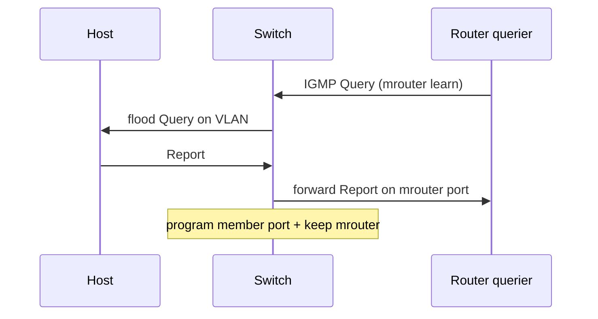

# Snooping control terms

Layer-2 multicast troubleshooting is vocabulary-heavy. These terms appear in every healthy design and every failure write-up.

| Term | Meaning |
|---|---|
| **Mrouter port** | Port toward a multicast router/querier, learned from Queries/PIM Hellos or statically configured |
| **Listener / member port** | Port on which a valid Report was observed (or static join programmed) |
| **Snooping querier** | Switch function that generates Queries when no L3 multicast router exists; it need not route data |
| **Unknown multicast** | Data for a group with no table entry—platform may flood, drop, or constrain |
| **Report suppression / proxying** | Switch aggregation of host reports; changes what uplink captures show |
| **Fast / immediate leave** | Prune port on Leave without waiting for group-specific queries |

Related: [Default bridge behavior](01_Default_Bridge_Behavior.md), [Leave processing](03_Leave_Processing.md), [Mrouter ports](07_Mrouter_Ports_Querier_Proxying.md).

## How ports are learned



1. Queries or PIM Hellos mark **mrouter** ports.
2. Reports mark **listener** ports for `(VLAN,G)` or `(VLAN,S,G)`.
3. Data is forwarded to the union of listener + mrouter ports (policy permitting).
4. Leaves / ageing remove listener ports; mrouter ports persist while Queries/Hellos continue.

## Configuration patterns

### Cisco-like — static mrouter + querier

```text
ip igmp snooping vlan 120
ip igmp snooping vlan 120 mrouter interface Port-channel10
ip igmp snooping querier
ip igmp snooping querier address 192.0.2.2
!
show ip igmp snooping mrouter
show ip igmp snooping querier
```

### Junos

```text
set protocols igmp-snooping vlan FEED-VLAN interface ae10.0 multicast-router-interface
show igmp-snooping membership
```

### FRR / Linux bridge notes

Mrouter equivalent is often “router port” or querier election on the bridge; confirm the NOS manual—Linux bridge MDB is not Cisco CLI.

## Interactions

| Mechanism | Relationship |
|---|---|
| **IGMPv3** | May need `(S,G)` snooping entries, not only MAC |
| **Proxy reporting** | Upstream sees fewer reports than hosts sent |
| **MLAG** | Dual mrouter / dual active paths need explicit design |
| **PIM DR** | L3 role; snooping only needs to reach a router |

## Verification

1. List mrouter ports—must include the path to the LHR/querier.
2. Join a host; member port appears; uplink capture still sees Report (or proxy).
3. Clear membership; confirm ageing vs immediate leave policy.
4. Unknown group: document flood vs drop behavior for the platform.

```text
show ip igmp snooping mrouter
show ip igmp snooping groups vlan 120
show ip igmp snooping querier
```

## Risks

- Dynamic mrouter learning fails on filtered PIM/Query uplinks.
- Proxy reporting hides host bugs during packet captures.
- Unknown-multicast drop mistaken for “PIM down.”

## Interview framing

“Mrouter ports point at routers, listener ports point at hosts, and the querier keeps soft state alive—unknown multicast policy decides what happens before those entries exist.”

---
