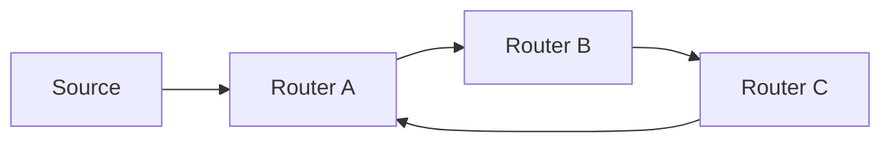

# Why multicast needs RPF

Unicast forwarding follows only a **destination**. Multicast must accept traffic from a **source** and replicate it along a tree without forming loops. **Reverse Path Forwarding (RPF)** validates the source-facing direction before the router uses group-facing outgoing state.

Without RPF, any router that heard a multicast packet could re-flood it out every interface, and redundant paths would amplify into a storm.

## Loop problem (conceptual)



If B and C both forward toward each other without checking arrival direction, one packet becomes many. RPF requires: *arrive only from the interface used to reach S (or the RP for shared-tree traffic)*.

Related: [RPF check](02_RPF_Check.md), [MRIB and asymmetry](03_MRIB_and_Asymmetry.md), [PIM Assert](05_PIM_Assert.md).

## What RPF guarantees (and does not)

| Guarantees | Does not guarantee |
|---|---|
| Loop-free acceptance of `(S,G)` / `(*,G)` data | That receivers exist |
| Consistent upstream for PIM Joins | Optimal delay on every path |
| Discard of packets from wrong interface | Correct L2 snooping |

## Configuration patterns

RPF is enabled whenever multicast routing is on; you configure the **MRIB inputs**, not a separate “rpf on” switch.

### Cisco IOS / IOS XE

```text
ip multicast-routing
!
! Optional: multicast BGP table for RPF
router bgp 65000
 address-family ipv4 multicast
  neighbor 198.51.100.2 activate
 exit-address-family
!
! Last resort override (use sparingly)
ip mroute 192.0.2.10 255.255.255.255 198.51.100.1
```

### Junos

```text
set protocols pim interface all mode sparse
set routing-options static route 192.0.2.10/32 next-hop 198.51.100.1
! Prefer inet.2 / rib-group designs for multicast RPF separation
```

### FRRouting

```text
ip multicast-routing
ip mroute 192.0.2.10/32 198.51.100.1
```

See [MBGP RPF config](../14_Configuration_and_Observation/09_MBGP_Multicast_RPF_Config_Pattern.md).

## Interactions

| Mechanism | Relationship |
|---|---|
| **PIM Join** | Sent toward RPF neighbor of S or RP |
| **Assert** | Can override upstream neighbor on multiaccess LAN |
| **ECMP** | One selected member becomes the RPF interface |
| **uRPF (unicast)** | Different feature; do not confuse with multicast RPF |

## Verification

1. Note RPF interface and neighbor for `S`.
2. Capture data arriving on that interface—accepted.
3. Inject the same flow on a non-RPF interface—dropped / RPF failure counter.
4. Change IGP metric; confirm RPF and Joins move.

```text
show ip rpf 192.0.2.10
show ip mroute 192.0.2.10 232.10.10.10
show ip mroute count
```

## Risks

- Static mroutes that survive topology repair and blackhole trees.
- Assuming unicast ping success proves multicast RPF.
- Ignoring MBGP when multicast topology must differ from unicast.

## Interview framing

“Unicast cares where the packet is going; multicast RPF cares where it came from—accept only on the reverse path to S (or the RP), or you loop.”

---
