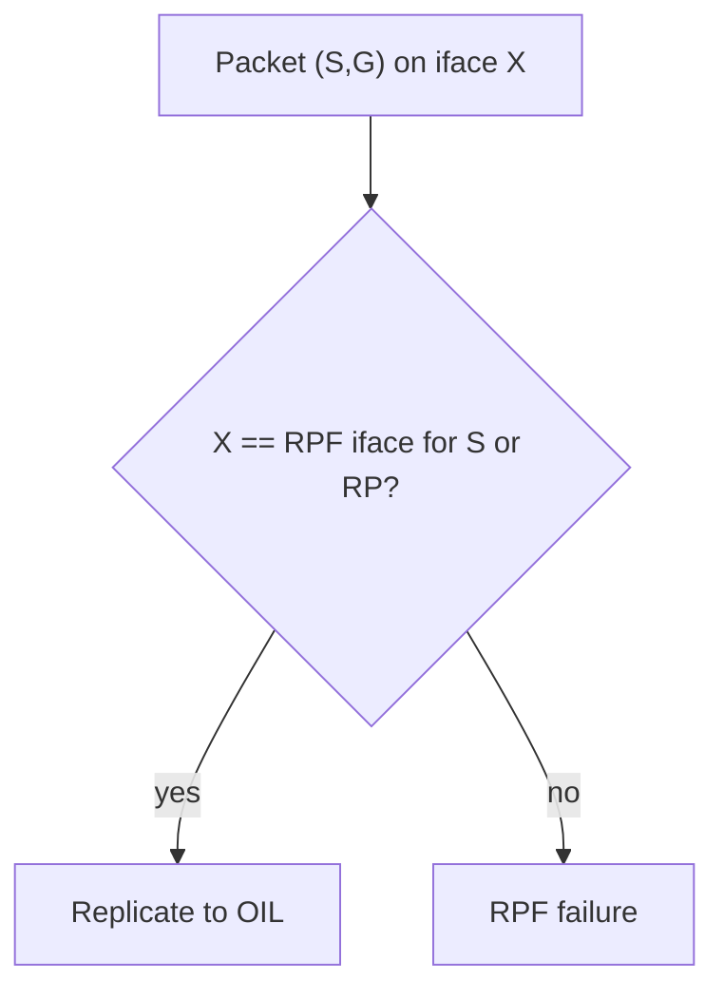

# Reverse Path Forwarding check

For **`(S,G)`**, the router asks: if I sent unicast toward `S` using the **MRIB**, which interface and neighbor would I use? The multicast packet must arrive from that direction. Otherwise it is normally discarded as an **RPF failure**.

For shared-tree **`(*,G)`** traffic, the RPF target is generally the **RP** rather than the source.

```text
(192.0.2.10, 232.10.10.10)
IIF: Ethernet1/1, RPF neighbor 198.51.100.1
OIL: Ethernet1/2, Port-Channel20
```

A packet arriving on Ethernet1/1 passes and is replicated to the OIL. Arrival on Ethernet1/3 fails.

## Check algorithm (conceptual)

1. Extract source `S`, group `G`, VRF.
2. Select MRIB route toward tree root (`S` or RP).
3. Resolve RPF interface + upstream neighbor.
4. Compare packet ingress interface (and often neighbor) to that result.
5. Pass → continue OIL replication; fail → drop / count.



Related: [Why RPF](01_Why_RPF_Is_Needed.md), [MRIB asymmetry](03_MRIB_and_Asymmetry.md), [ECMP selection](06_RPF_Selection_ECMP_and_Unnumbered_Links.md), [Case: RPF after route change](../16_Practical_Cases/03_RPF_Failure_After_Route_Change.md).

## Common pass/fail scenarios

| Arrival | MRIB says | Result |
|---|---|---|
| Same L3 iface as RPF | toward S | Pass |
| Parallel ECMP member not selected | equal cost other path | Fail (often) |
| After link repair, old path | new RPF iface | Fail until state refreshes |
| Shared-tree packet | RPF to RP | Pass if toward RP |

## Configuration patterns

### Cisco IOS / IOS XE

```text
ip multicast-routing
ip pim sparse-mode
! on every multicast interface
interface GigabitEthernet0/0
 ip address 198.51.100.1 255.255.255.252
 ip pim sparse-mode
!
show ip rpf 192.0.2.10
show ip rpf 192.0.2.10 detail
```

### Junos

```text
set protocols pim interface ge-0/0/0.0 mode sparse
show pim rpf 192.0.2.10
show multicast rpf 192.0.2.10
```

### FRRouting

```text
interface eth0
 ip pim
!
show ip rpf 192.0.2.10
show ip mroute
```

## Interactions

| Mechanism | Relationship |
|---|---|
| **MBGP inet multicast** | May prefer multicast SAFI over unicast for RPF |
| **Static mroute** | Overrides MRIB lookup for listed prefixes |
| **PIM Join** | Always toward current RPF neighbor |
| **Tunnel / overlay** | RPF may resolve to tunnel if that is the MRIB path |

## Verification

1. `show ip rpf S` matches `IIF` in `show ip mroute`.
2. Source ping works via a path that is **not** RPF → multicast still fails (expected).
3. Clear / withdraw the winning route; RPF and Joins follow.
4. Watch RPF failure counters while tapping the wrong interface.

```text
show ip rpf 192.0.2.10
show ip mroute 192.0.2.10 232.10.10.10
show ip mroute 192.0.2.10 232.10.10.10 count
```

## Risks

- Fixing “RPF fails” with a static mroute before understanding ECMP/MBGP.
- Checking unicast RIB only (`show ip route`) and missing multicast RIB.
- Ignoring VRF: wrong table ⇒ wrong RPF.

## Interview framing

“RPF asks which interface the MRIB uses to reach S—or the RP for (*,G)—and drops multicast that arrives anywhere else.”

---
