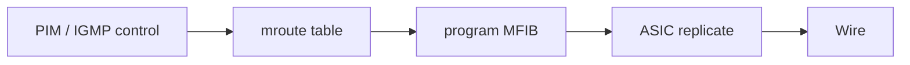

# Multicast RIB versus forwarding hardware

The control-plane **mroute** contains state type, timers, flags, RPF neighbor, IIF, and OIL. The **MFIB** (Multicast FIB) contains programmed **hardware** replication state. A correct mroute with missing or stale hardware state can still drop traffic.

## Two views of the same tree

| Layer | What you see | Failure mode |
|---|---|---|
| Control (mroute) | Joins, flags, RPF, OIL | Wrong tree / RPF |
| Hardware (MFIB) | ASIC replication entries | Silent drop, partial OIL |
| Interface counters | pkt in/out | Queue / ACL / TTL drops |
| Capture | bits on the wire | Proves reality |

Related: [OIL inheritance](07_Forwarding_Rules_and_OIL_Inheritance.md), [Network device state](../14_Configuration_and_Observation/02_Network_Device_State.md), [Troubleshooting data from source](../15_Troubleshooting/03_Data_From_Source.md).

## Comparison workflow

1. Confirm software `(S,G)` / `(*,G)` looks correct.
2. Confirm hardware entry exists for the same VRF and interfaces.
3. Compare ingress accept counters vs egress replication counters.
4. Capture on both sides of the device.
5. Check replication resource scale (platform-specific).



## Configuration patterns

Programming is automatic; exposure differs by vendor.

### Cisco IOS / IOS XE

```text
show ip mroute 192.0.2.10 232.10.10.10
show ip mfib 192.0.2.10 232.10.10.10
show ip mfib 192.0.2.10 232.10.10.10 count
show platform software ip fp active mfib
! exact platform commands vary by ASIC generation
```

### Junos

```text
show multicast route group 232.10.10.10 source 192.0.2.10 extensive
show multicast next-hops
show pfe route multicast
```

### FRRouting + Linux dataplane

```text
show ip mroute
ip mroute show
# dataplane may be kernel mroute / zebra; confirm packets with tcpdump
```

## Interactions

| Mechanism | Relationship |
|---|---|
| **SSO / NSF** | Control preserved while hardware reprograms—watch gaps |
| **Scale limits** | Too many (S,G) → admit control, fail hardware |
| **ACL / QoS** | Can drop after MFIB “success” |
| **Negative cache** | Control state without useful OIL |

## Verification

1. Software OIL lists `Gi0/1`; hardware egress counter on `Gi0/1` increments.
2. Clear MFIB / reprogram (platform) and watch traffic recovery.
3. Exhaust lab scale; observe new groups stuck in control only.
4. Match sequence numbers across ingress and egress captures.

```text
show ip mroute count
show ip mfib count
show interfaces GigabitEthernet0/1 | include packets
```

## Risks

- Declaring victory from `show ip mroute` alone.
- Ignoring line-card vs active RP differences on chassis.
- Capturing only on the control-plane CPU path (punted samples).

## Interview framing

“mroute is control state; MFIB is what the ASIC actually replicates—always compare both plus wire captures when counters disagree.”

---
