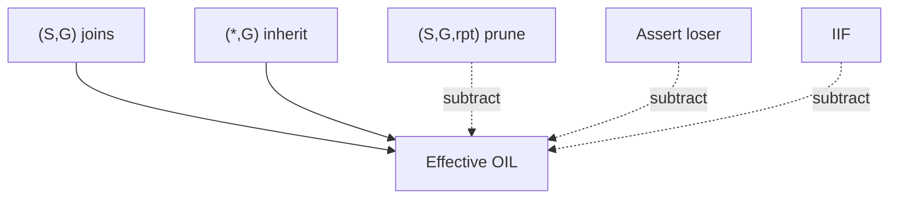

# Multicast forwarding rules and OIL inheritance

For each multicast packet, a router conceptually performs two decisions:

1. **Acceptance:** did `(S,G)` arrive on an eligible RPF interface?
2. **Replication:** which outgoing interfaces are interested and permitted?

A destination group lookup alone is insufficient because the same `G` can have different sources, incoming paths, prunes, and outgoing branches.

## Conceptual lookup

1. Identify `(S,G)` from the IP header and VRF.
2. Find source-specific forwarding state if present.
3. Otherwise use applicable `(*,G)` shared-tree state for ASM.
4. Determine whether the packet is arriving as source-tree or RP-tree traffic.
5. Check the expected IIF/RPF neighbor.
6. Build the effective OIL.
7. Remove the IIF and any pruned, Assert-loser, scoped, filtered, or down interfaces.
8. Replicate once to every remaining OIF and apply per-interface TTL/Hop Limit processing.

Implementations optimize this into MFIB entries; the logical rules remain useful for diagnosis.

Related: [State notation](../03_Service_Models_and_Terminology/03_State_and_Tree_Notation.md), [Control vs MFIB](04_Control_Plane_vs_MFIB.md), [SPT switchover](../08_PIM/11_SPT_Switchover_and_RPT_Prune.md).

## Effective OIL

For an ASM `(S,G)`, downstream interest can be inherited from `(*,G)`:

```text
effective OIL =
    explicit (S,G) joined interfaces
  + eligible interfaces inherited from (*,G)
  - (S,G,rpt) pruned interfaces
  - Assert-loser interfaces
  - IIF
  - policy/boundary/down interfaces
```

This explains why an `(S,G)` entry can forward onto an interface that did not send an explicit source Join, and why `(S,G,rpt)` is needed after only one source switches away from the RPT.



## Same-interface forwarding

Ordinary routed forwarding does not send a copy back out the packet's IIF. On shared source/receiver LANs, local-host delivery and PIM Assert/DR behavior complicate what appears in control output, but the router must not form a replication loop. If a CLI lists an interface as both IIF and inherited OIF, inspect the effective MFIB and flags rather than assuming a duplicate is transmitted.

## Negative cache and null OIL

Platforms may create `(S,G)` state with no OIF when traffic arrives without receivers. This negative/cache state can suppress repeated control punts or record Register/source activity. It proves **source observation**, not receiver interest.

Likewise, a non-null control OIL does not guarantee packets leave the box if the MFIB is unprogrammed, TTL expires, an ACL drops, replication resources are exhausted, or the interface queue discards them.

## Packet counters

Counters can live at different layers: control-plane mroute cache; hardware `(S,G)`/replication entry; physical ingress/egress; queue/drop reason; tunnel encapsulation; receiver NIC/application. Counter absence on one CLI is not proof of no traffic. Use synchronized deltas and follow a sequence-marked packet across boundaries.

## Configuration patterns

OIL is built from membership + PIM; boundaries and filters subtract.

### Cisco IOS / IOS XE

```text
interface Vlan200
 ip pim sparse-mode
 ip igmp version 3
!
ip access-list standard BLOCK-G
 deny 239.99.99.99
 permit any
interface GigabitEthernet0/0
 ip multicast boundary BLOCK-G
!
show ip mroute 239.1.1.1
show ip mfib 239.1.1.1
```

### Junos

```text
set protocols igmp interface irb.200 version 3
set protocols pim interface irb.200 mode sparse
show multicast route group 239.1.1.1 extensive
show pim join extensive
```

### FRRouting

```text
interface vlan200
 ip pim
 ip igmp
!
show ip mroute
```

## Interactions

| Mechanism | Relationship |
|---|---|
| **IGMP/MLD** | Creates local OIL interest on LHR |
| **(S,G,rpt)** | Removes inherited shared-tree forwarding for S |
| **Assert** | Loser OIF suppressed |
| **Boundary/ACL** | Policy subtraction from OIL |

## Verification

1. Receiver join only: OIL gains receiver iface; IIF toward S/RP.
2. Second VLAN joins: OIL grows; no change to IIF.
3. SPT switch: confirm `(S,G,rpt)` prevents shared-tree duplicates.
4. Assert loser: iface listed in control but not forwarding in MFIB.
5. Boundary applied: group absent from egress even with Join.

```text
show ip mroute 192.0.2.10 232.10.10.10
show ip mfib 192.0.2.10 232.10.10.10
show ip igmp groups
```

## Risks

- Reading inherited OIL as “someone Joined (S,G) here.”
- Ignoring negative cache as “receivers present.”
- Trusting control OIL while hardware entry is incomplete.

## Interview framing

“After RPF accept, the effective OIL is joins plus (*,G) inheritance, minus rpt prunes, Assert losers, IIF, and policy—then the MFIB must actually program that list.”

---
