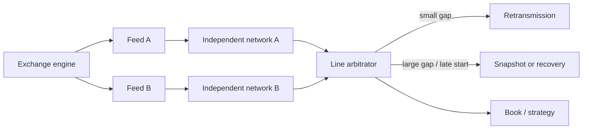

# Typical market-data architecture

[← Module index](README.md) · [↑ Multicast master index](../Multicast_Deep_Dive.md)

---

Nasdaq MoldUDP64, CME MDP 3.0, and NYSE feeds all demonstrate variants of sequenced UDP multicast, redundant lines, and retransmission/refresh workflows.

