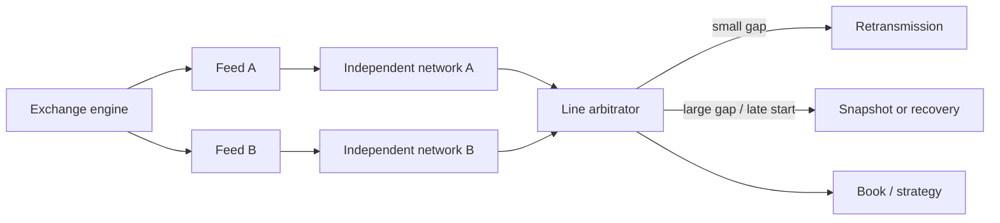

# Typical market-data architecture


```mermaid
flowchart LR
    E["Exchange engine"] --> A["Feed A"]
    E --> B["Feed B"]
    A --> NA["Independent network A"]
    B --> NB["Independent network B"]
    NA --> H["Line arbitrator"]
    NB --> H
    H -->|"small gap"| RR["Retransmission"]
    H -->|"large gap / late start"| SR["Snapshot or recovery"]
    H --> OB["Book / strategy"]
```

Nasdaq MoldUDP64, CME MDP 3.0, and NYSE feeds all demonstrate variants of sequenced UDP multicast, redundant lines, and retransmission/refresh workflows.

## Building blocks

| Block | Role |
|---|---|
| Primary incremental feed(s) | Real-time sequenced UDP multicast |
| Redundant line B | Independent path, often separate group/source |
| Retransmit / rewind | Unicast fill for small gaps |
| Snapshot / refresh | Bulk state for late join or large loss |
| Line handler | Normalize, arbitrate, expose book events |

## Addressing sketch (lab docs)

```text
Feed A (S,G,port):  192.0.2.10  / 232.10.10.10 / 15000
Feed B (S,G,port):  192.0.2.11  / 232.10.10.11 / 15000
Rewind unicast:     192.0.2.50:4001
Snapshot:           192.0.2.51:4002
Receiver VLAN A/B:  198.51.100.0/24 and 198.51.101.0/24
```

Related: [A/B arbitration](03_AB_Line_Arbitration.md), [Low-latency design pattern](08_Low_Latency_Design_Pattern.md).

## Network placement

- Keep A and B in distinct failure domains through the last shared point you can afford.
- Place PIM boundaries so market-data groups do not leak into office/voice VRFs.
- Size last-hop and leaf uplinks for **peak pps**, not busy-hour averages ([Capacity math](05_Capacity_Math.md)).

## Configuration patterns

### Cisco — PIM-SSM edge toward receivers (sketch)

```text
ip pim ssm default
access-list 10 permit 232.10.10.0 0.0.0.255
!
interface Vlan100
 ip address 198.51.100.1 255.255.255.0
 ip pim sparse-mode
 ip igmp version 3
```

### Host

```text
join A and B on separate NICs / namespaces when possible
log session IDs and sequence spaces per channel
```

## Interactions

| Mechanism | Relationship |
|---|---|
| **IGMPv3** | INCLUDE sources published by the venue |
| **QoS** | EF/strict for incremental; separate class for snapshot bulk |
| **Monitoring** | Per-line gap metrics before and after arbitration |

## Verification

```text
show ip mroute 192.0.2.10 232.10.10.10
show ip igmp groups
tcpdump -ni eth0 'udp and dst host 232.10.10.10'
# App: gaps_a, gaps_b, gaps_arb, rewind_ok
```

## Risks

- Snapshot traffic contending on the same policer as incremental.
- One “distribution switch” shared by A and B despite two groups.
- Assuming venue naming (Mold/MDP) implies identical recovery semantics.

## Interview framing

“A typical stack is dual sequenced multicast lines into an arbitrator, with unicast rewind for small gaps and snapshot for large loss or late start—independence of A/B paths is part of the architecture, not an afterthought.”

---
