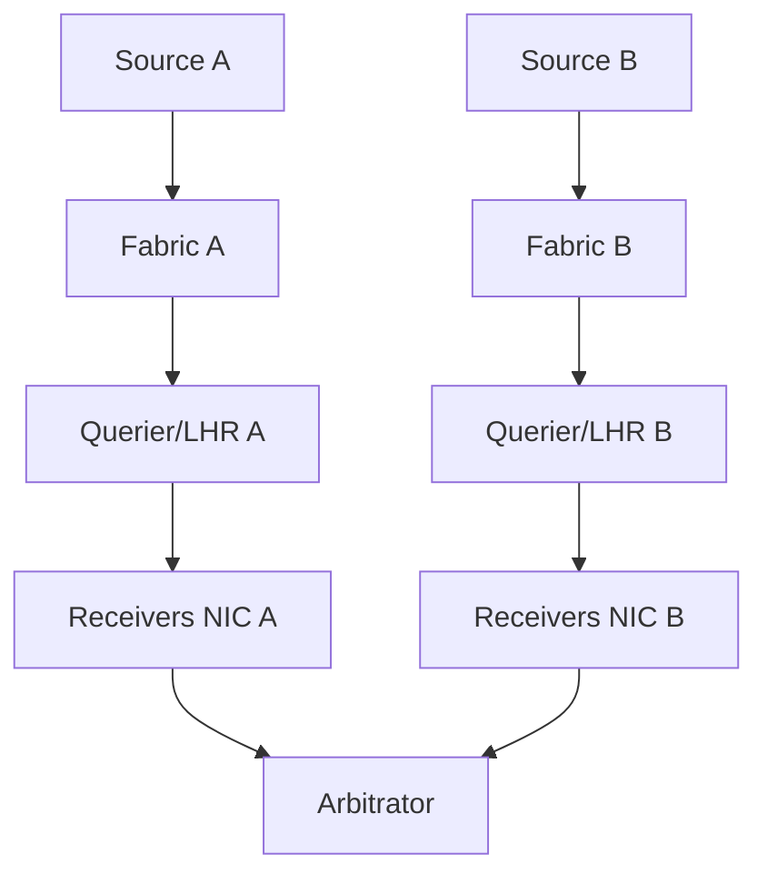

# Low-latency multicast design pattern

For a controlled one-source feed with many in-facility receivers:

- SSM and IGMPv3;
- redundant source/feed paths in distinct failure domains;
- PIM-SSM only across required routed boundaries;
- small receiver VLANs with redundant snooping queriers;
- immediate source-rooted trees;
- source/group/port allowlists;
- hardware timestamps and per-hop counters;
- no fragmentation;
- peak pps/microburst capacity tests;
- application sequencing, arbitration, and recovery.

Use ASM when imposed by the venue or legacy system, then engineer RP and source controls explicitly.

## Reference pattern



Related: [Why exchanges use multicast](01_Why_Exchanges_Use_Multicast.md), [Boundary principle](../13_Security/03_Boundary_Principle.md).

## Design checklist

| Item | Choice |
|---|---|
| Mode | PIM-SSM / IGMPv3 INCLUDE |
| Groups | `232.x` per channel; documented `(S,G,port)` |
| L2 | Small VLAN, snooping on, dual queriers |
| L3 | Minimal hops; symmetric RPF intentional |
| Security | Boundary ACL + source allowlist |
| Host | Dual NIC, tuned rings, stale timers |
| Evidence | Independent failure tests logged |

## Configuration patterns

### Cisco — SSM core + boundary

```text
ip pim ssm default
!
interface Vlan100
 ip pim sparse-mode
 ip igmp version 3
 ip multicast boundary ACL-MD-OUT filter-autorp
!
ip access-list standard ACL-MD-OUT
 permit 232.10.10.0 0.0.0.255
 deny 224.0.0.0 15.255.255.255
```

Full ACL examples: [Multicast boundary and ACL config](../14_Configuration_and_Observation/16_Multicast_Boundary_and_ACL_Config.md).

### Junos (sketch)

```text
set protocols igmp interface irb.100 version 3
set protocols pim interface irb.100 mode sparse
set routing-options multicast ssm-groups 232.0.0.0/8
```

## Interactions

| Mechanism | Relationship |
|---|---|
| **ASM venue** | Local RP anycast + MSDP only if required |
| **EVPN/MVPN** | Map customer SSM into provider trees carefully |
| **QoS** | Bounded strict priority at every replication edge |

## Verification

1. Receiver leave → OIL prune without RP involvement (SSM).
2. Kill fabric A → arbitrator continues on B; no stale.
3. Oversize packet test → no fragments on wire.
4. Peak pps test → watermarks within budget.

```text
show ip mroute 192.0.2.10 232.10.10.10
show ip igmp groups
show ip rpf 192.0.2.10
```

## Risks

- “Temporary” ASM for convenience without RP harding.
- Shared leaf for A/B.
- Skipping microburst tests because average util looks fine.

## Interview framing

“Controlled in-facility feeds default to SSM, dual independent paths, tight boundaries, no fragmentation, and app-level arbitration—ASM only when the venue forces it, with explicit RP controls.”

---
