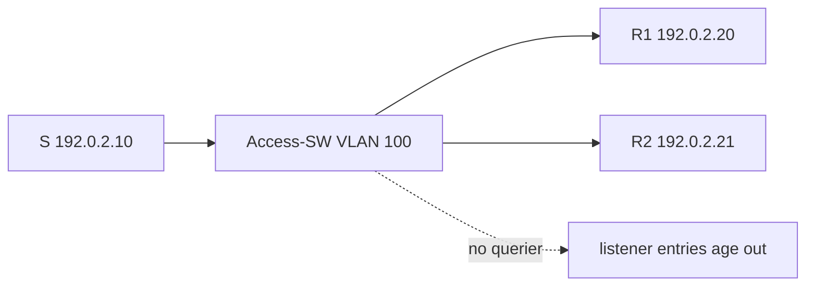

# Case 1: Same-VLAN multicast with no router

[← Module index](README.md) · [↑ Multicast master index](../Multicast_Deep_Dive.md)

---

## Topology and symptom

Sender `192.0.2.10` and receivers `192.0.2.20`–`192.0.2.25` share VLAN 100 on Access-SW. Group is `239.10.10.10`. No L3 router, no PIM, and no HSRP/VRRP gateway sits in the VLAN. After a quiet period of several minutes, receivers stop seeing data even though the sender still transmits.

## Failure mechanism

Same-VLAN IP multicast is Layer 2 replication: the sender maps `G` to a multicast MAC; IGMP reports create snooping state; the switch floods only interested ports. PIM is unnecessary. The hidden dependency is the querier. With IGMP snooping enabled but no multicast router port and no snooping querier, the switch stops refreshing listener state. Entries age out and the switch either drops or fails to replicate to receiver ports.

## Evidence

- sender capture on VLAN 100 still shows UDP to `239.10.10.10`;
- early after join, `show igmp snooping groups` lists the receivers;
- after the aging timer, the group entry disappears or OIL shrinks to empty;
- no multicast router port is learned;
- no PIM neighbor and no IGMP querier address in the VLAN;
- unicast between hosts remains fine.

## Investigation

1. confirm sender and receivers are truly in the same L2 domain (same VLAN / bridge);
2. check IGMP snooping global and per-VLAN state;
3. look for a querier election or configured snooping querier;
4. compare group membership before and after the silence interval;
5. verify whether unknown-multicast flood is restricted (drop vs flood);
6. rule out storm-control or ACL drops on the sender port.

## Fix and validation

Enable an IGMP snooping querier on Access-SW (or introduce a redundant L3 querier pair). Prefer two queriers with staggered priorities so a single device failure does not recreate the silent blackhole.

Join from a receiver, wait past the former age-out window, and confirm the group entry and port list remain populated while data continues.

## Lesson

Same-VLAN multicast needs no router for forwarding, but snooping still needs a querier to keep listener state alive. Design for querier redundancy, not only for data paths.
