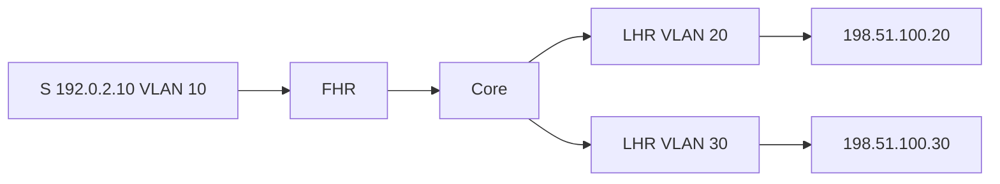

# Case 2: SSM across routed receiver VLANs

[← Module index](README.md) · [↑ Multicast master index](../Multicast_Deep_Dive.md)

---

## Topology and symptom

Source `192.0.2.10` sits in VLAN 10 behind FHR. Receivers sit in VLAN 20 (`198.51.100.20`) and VLAN 30 (`198.51.100.30`) behind separate LHRs. Application joins SSM group `232.10.10.10` with source include `{192.0.2.10}`. Operators expect an RP because “PIM-SM always needs one,” yet no RP is configured and they fear the design is incomplete.

## Failure mechanism

There is no failure if state is built correctly. For SSM, each LHR translates an IGMPv3 `INCLUDE {192.0.2.10}` report into `(192.0.2.10,232.10.10.10)` PIM Join state. RPF paths converge toward the source. No `*,G` RP tree and no Register path are required. The interview trap is conflating PIM-SM ASM (needs an RP) with PIM-SSM (does not).

A real outage appears only when IGMPv2 is used, the group is outside `232/8`, SSM mapping is missing, or RPF toward `192.0.2.10` is broken.

## Evidence

- receiver sockets show IGMPv3 INCLUDE for `192.0.2.10` / `232.10.10.10`;
- LHR has `(S,G)` Join state toward the source RPF neighbor;
- no RP mapping for `232.10.10.10` and no Register counters incrementing;
- FHR OIL includes the core path toward both LHRs;
- receivers in VLAN 20 and VLAN 30 both decode the feed.

## Investigation

1. confirm the group is in `232.0.0.0/8` (or explicitly mapped to SSM);
2. verify IGMPv3 on receiver interfaces and host stacks;
3. inspect `(S,G)` PIM state end-to-end, not `*,G`;
4. check RPF for `192.0.2.10` on every hop;
5. ensure no ACL or boundary strips SSM Joins;
6. if ASM habits linger, confirm nobody is waiting on Bootstrap/Auto-RP for this group.

## Fix and validation

Keep SSM as designed: no RP for `232.10.10.10`. Fix host IGMP version, SSM ACL, or RPF if data is missing. Do not invent an RP “just in case.”

From each receiver VLAN, join `(192.0.2.10,232.10.10.10)`, confirm `(S,G)` state only, and validate packet arrival with matching sequence numbers.

## Lesson

PIM-SM ASM needs an RP; PIM-SSM builds source trees from IGMPv3 INCLUDE reports and does not. Across VLANs the hard part is RPF and IGMP version, not RP discovery.
