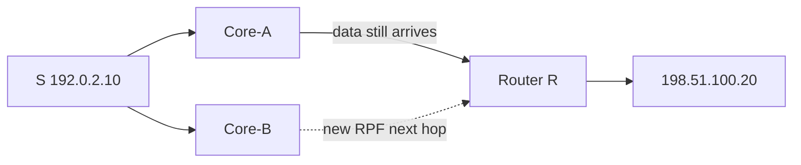

# Case 3: RPF failure after a route change

[← Module index](README.md) · [↑ Multicast master index](../Multicast_Deep_Dive.md)

---

## Topology and symptom

Source `192.0.2.10` sends `(192.0.2.10,232.10.10.10)` into the fabric. Receiver `198.51.100.20` in VLAN 50 was receiving the feed through Core-A. After a routing change, a more-specific route to `192.0.2.0/24` (or to `192.0.2.10/32`) appears via Core-B. Membership and OIL look healthy, but the receiver sees silence.

## Failure mechanism

Multicast forwarding accepts a packet only if it arrives on the RPF interface toward `S` (or toward the RP for `*,G`). Traffic still physically arrives through Core-A, but the control plane now selects Core-B as RPF IIF. The router drops Core-A packets as non-RPF. Receiver joins and OIL do not heal a source-side mismatch.

## Evidence

- IGMP/PIM membership for `232.10.10.10` remains present;
- OIL toward the receiver is non-empty;
- `show rpf 192.0.2.10` now points at Core-B;
- capture on the Core-A ingress still shows the stream;
- RPF-failure / wrong-IIF drop counters increment on Core-A facing interface;
- unicast ping to `192.0.2.10` may still succeed via either path.

## Investigation

1. note the exact time of the route change versus the outage start;
2. compare previous and current RPF interface/neighbor for `S`;
3. capture ingress on both Core-A and Core-B facing links;
4. check whether MRIB/mroute diverges from the unicast RIB;
5. inspect whether a more-specific, summary, or static altered the choice;
6. confirm PIM Join moved to the new RPF neighbor while data did not.

## Fix and validation

Restore the intended topology so data ingress matches RPF, or deliberately engineer multicast-specific reachability (MRIB / multicast BGP / static mroute) so both Join and data use Core-B. Changing the receiver join does not fix source-side RPF.

After the fix, clear and rejoin, verify RPF IIF equals the data ingress, and confirm drop counters stop rising.

## Lesson

Intact membership proves interest, not accept path. After any route change, compare where packets arrive with where RPF says they must arrive.
