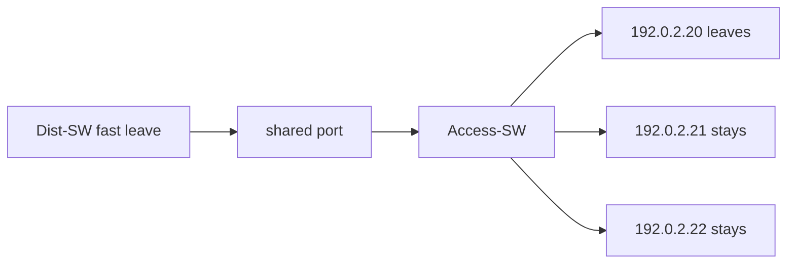

# Case 5: Fast leave blackholes shared receivers

[← Module index](README.md) · [↑ Multicast master index](../Multicast_Deep_Dive.md)

---

## Topology and symptom

Receivers `192.0.2.20`, `192.0.2.21`, and `192.0.2.22` sit behind one downstream switch port on Access-SW (VLAN 100, group `239.10.10.10`). Upstream Dist-SW has IGMP immediate/fast leave enabled toward that port. When host `.20` leaves the group, hosts `.21` and `.22` lose the feed instantly even though they never left.

## Failure mechanism

Fast leave treats a Leave as proof that nobody remains on the port, so the upstream device removes the port from the group OIL without a group-specific query. That is correct for true one-listener-per-port designs. On a shared attachment, one host’s Leave removes the only upstream replication path for every remaining listener behind the same port.

## Evidence

- Leave from `192.0.2.20` is visible on the shared uplink;
- Dist-SW immediately deletes the port from `239.10.10.10`;
- no IGMP group-specific query is sent before removal;
- Access-SW still shows `.21` / `.22` as members locally;
- capture above Dist-SW shows the stream continuing; below the shared port it stops;
- other VLANs/ports with single hosts are unaffected.

## Investigation

1. map how many hosts share each snooped uplink port;
2. check whether immediate/fast leave is enabled on Dist-SW;
3. capture Leave versus query/response timing around the event;
4. compare group port lists on Access-SW and Dist-SW;
5. reproduce with a second host leaving while others remain;
6. confirm the design intent: shared L2 vs one host per edge port.

## Fix and validation

Disable immediate leave on shared attachments, or enforce genuine one-listener-per-port architecture (and keep fast leave only there). Standard last-member query intervals protect multi-host ports.

Have one of three hosts leave, wait through the query interval, and confirm the other two still receive `239.10.10.10` without interruption.

## Lesson

Fast leave optimizes for single-host ports. On shared ports it turns one Leave into a multi-receiver blackhole. Match the feature to the attachment model.
