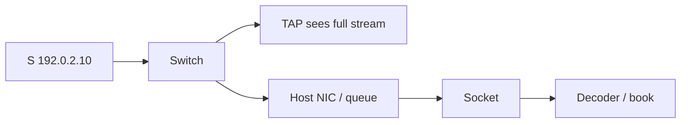

# Case 6: Capture sees data while the application reports gaps

[← Module index](README.md) · [↑ Multicast master index](../Multicast_Deep_Dive.md)

---

## Topology and symptom

Source `192.0.2.10` publishes `(192.0.2.10,232.10.10.10)` to receiver host `198.51.100.20` in VLAN 40. An inline TAP or SPAN shows continuous UDP with monotonic sequence numbers. The book application on the host reports gaps, retransmits, or “feed stale” alarms during bursts.

## Failure mechanism

The network delivered the packets to the wire the TAP sees. Loss or rejection happens later: NIC ring overflow, kernel or kernel-bypass queue overflow, process descheduling, decoder rejection (bad session, unexpected template), or multi-socket reuse where another consumer steals datagrams. An external TAP can therefore show frames the host stack never hands to the application.

## Evidence

- TAP/SPAN sequence space is contiguous across the incident window;
- host drop counters (ring, softnet, bypass API) increment during bursts;
- socket receive queue hits high-water or `recv` returns truncated reads;
- application logs gaps whose missing ranges still appear on the TAP;
- CPU scheduling latency spikes correlate with gap timestamps;
- a second process bound to the same group may compete for datagrams.

## Investigation

1. align timestamps across TAP, host, and application logs;
2. compare the same sequence numbers at TAP → NIC/bypass API → socket → decoder → book;
3. check NIC ring sizes, interrupt coalescing, and busy-poll / bypass settings;
4. inspect socket buffer sizes and overflow statistics;
5. verify only the intended process owns the membership;
6. reproduce with a lighter consumer to separate network loss from host loss.

## Fix and validation

Right-size rings and socket buffers, pin/poll the consumer, isolate the feed onto a dedicated queue/core, and fix decoder/session assumptions. Do not blame PIM or RPF when the TAP already proves wire delivery.

Re-run the burst test and require identical sequence coverage from TAP through the book stage.

## Lesson

A clean wire capture proves the network path, not host delivery. Stage the same sequences through TAP, NIC, socket, decoder, and application before changing multicast routing.
