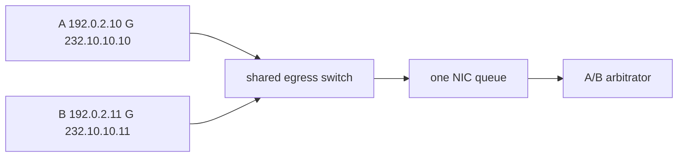

# Case 7: A and B feeds fail together

[← Module index](README.md) · [↑ Multicast master index](../Multicast_Deep_Dive.md)

---

## Topology and symptom

Primary feed A uses `(192.0.2.10,232.10.10.10)`. Secondary feed B uses `(192.0.2.11,232.10.10.11)`. Both are supposed to be independent. During a microburst, receiver `198.51.100.20` loses the same logical sequences on A and B at once, so dual-feed arbitration cannot heal the gap.

## Failure mechanism

Although A and B use different sources and groups, both cross the same egress switch and land in one NIC queue (or one shared DMA / busy-poll thread). A microburst overruns that shared queue, so both copies of the same logical sequence are discarded together. Protocol duplication without path and queue diversity is not a failure-domain split.

## Evidence

- A and B gap timestamps align within microseconds;
- missing sequence ranges on A match those on B for the same events;
- egress port or NIC queue drop counters spike once, not twice on separate paths;
- both groups share the last-hop switch and the same RSS/queue mapping;
- core A/B paths farther upstream may still show clean captures;
- unicast control sessions on other queues remain healthy.

## Investigation

1. map full A and B data paths from source to host queue;
2. identify shared switches, uplinks, NICs, interrupt queues, and threads;
3. correlate drop counters on the shared egress and host queue;
4. compare TAP captures before versus after the shared element;
5. check RSS hash / flow director so both groups are not pinned together;
6. confirm the application’s diversity assumptions match the real topology.

## Fix and validation

Separate failure domains: diverse core paths, distinct last-hop switch planes, separate NICs or hardware queues, and isolated processing threads where required. Keep A/B groups hashed apart.

Inject a controlled microburst and verify a gap on A no longer implies the same gap on B.

## Lesson

Different multicast groups are not automatic redundancy. Diversity must include path, switch plane, NIC/queue, and consumer—not only group addresses.
