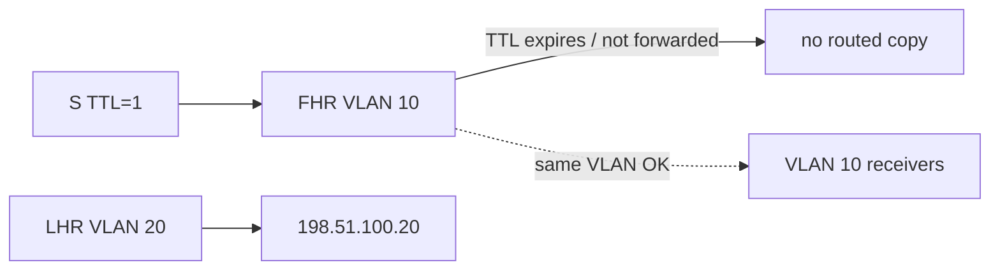

# Case 9: TTL confusion

[← Module index](README.md) · [↑ Multicast master index](../Multicast_Deep_Dive.md)

---

## Topology and symptom

Source `192.0.2.10` in VLAN 10 sends to `239.10.10.10` with IP TTL 1. Receivers in the same VLAN receive the feed. Receivers in VLAN 20 behind LHR `198.51.100.20` do not, even though IGMP membership, PIM `(*,G)`/`(S,G)` state, and RPF all look correct.

## Failure mechanism

Each routed hop decrements TTL. With TTL 1, the packet is eligible for local delivery on the source LAN but is not forwarded by the FHR into the PIM domain (or is dropped at the first hop). Control plane can still build trees from joins, so membership and PIM state appear healthy while data never leaves the source VLAN. TTL is a scope limiter, not a substitute for multicast boundaries and ACLs.

## Evidence

- same-VLAN capture shows UDP to `239.10.10.10` with TTL 1;
- FHR has OIL toward the core but forwards no packets (or TTL-expiry counters rise);
- LHR shows Join state and empty or idle MFIB hits;
- receiver in VLAN 20 never sees the group on the wire;
- raising TTL on a test sender immediately restores routed delivery;
- unicast to `198.51.100.20` works with normal TTL.

## Investigation

1. read TTL on a source-VLAN capture of the data plane;
2. confirm FHR multicast routing is enabled and PIM is up;
3. distinguish “no packets in” on LHR from RPF drops;
4. check for TTL-threshold or boundary features on interfaces;
5. verify the application’s intended distribution scope (LAN vs campus vs WAN);
6. ensure security policy uses boundaries/ACLs rather than hoping TTL alone suffices.

## Fix and validation

Set source TTL high enough for the longest intended routed path (common market-data values are well above 1). Enforce administrative scope with multicast boundaries and ACLs.

After increasing TTL, confirm FHR forwarding counters advance and VLAN 20 receivers decode continuously.

## Lesson

TTL 1 is a same-LAN scope, not a routed design. Correct PIM state cannot forward packets that expire at the first hop; size TTL for the path and lock scope with boundaries.
