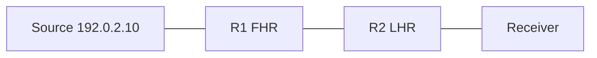

# Lab 4: Routed SSM

Build end-to-end PIM-SSM and prove RPF dependence.

## Topology



```text
Group:  232.10.10.10
Port:   15000
Links:  198.51.100.0/30 between R1-R2
```

## Objectives

- Verify IGMPv3 INCLUDE, `(S,G)` without RP, TTL decrement, prune after leave.
- Break RPF and observe drops / RPF-fail counters.

## Config touchpoints

```text
ip pim ssm default
interface <all PIM>
 ip pim sparse-mode
interface <receiver SVI>
 ip igmp version 3
```

Junos/FRR: enable sparse + SSM range `232.0.0.0/8`. See [PIM-SSM config](../14_Configuration_and_Observation/03_PIM_SSM_Config_Pattern.md).

## Tasks

1. Join `(192.0.2.10, 232.10.10.10)` on the receiver.
2. Confirm Report INCLUDE and PIM `(S,G)` Join toward source.
3. Start sender; verify RPF at each hop; note TTL.
4. Leave; confirm prune and OIL removal.
5. Change the route to `S` so traffic arrives on a non-RPF interface; observe failure counters.

## Failure injection

- Secondary equal-cost path carrying data while RPF selected the other.
- TTL=1 at source across two hops.
- IGMPv2-only receiver (no INCLUDE)—SSM fails closed.

## Expected evidence

```text
No RP mapping required
show ip mroute 192.0.2.10 232.10.10.10  -> IIF toward S, OIL toward receiver
After RPF break: RPF failures increment; sequences stop at R2
```

```text
show ip mroute 192.0.2.10 232.10.10.10
show ip rpf 192.0.2.10
show ip igmp groups
tcpdump -ni eth0 -vv igmp
```

## Cross-links

[SSM across VLANs](../16_Practical_Cases/02_SSM_Across_VLANs.md), [RPF failure](../16_Practical_Cases/03_RPF_Failure_After_Route_Change.md), [RPF selection](../07_RPF_and_Forwarding/06_RPF_Selection_ECMP_and_Unnumbered_Links.md).

---
