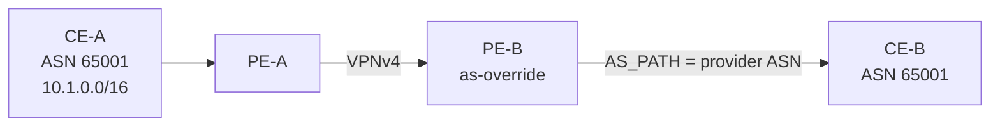

# as-override

`as-override` is a PE→CE export behavior used mainly in MPLS L3VPN (and similar VRF) designs. When advertising a VPN route to a CE, the PE replaces every occurrence of the **neighbor’s ASN** in AS_PATH with the **provider’s ASN** (implementation details vary slightly).

## Problem it solves

Two CE sites both use customer ASN `65001`. Site-A originates `10.1.0.0/16`. The route reaches PE-B as a VPNv4 path and is advertised to CE-B:

```text
AS_PATH as seen by CE-B without override:  65001
```

CE-B’s ASN is `65001`, so standard loop prevention rejects the route. The sites cannot communicate through the VPN even though the topology is intentional.



With as-override on PE-B toward CE-B:

```text
AS_PATH as seen by CE-B with override:  <provider-ASN>
```

CE-B no longer sees its own ASN and accepts the route.

## Where it is applied

| Location | Typical use |
|---|---|
| PE outbound to CE | Classic L3VPN same-ASN sites |
| Not on Internet eBGP | Overriding foreign ASNs on the public Internet destroys path integrity |
| VRF address-family | Scoped per customer VRF / neighbor |

as-override is a **sender-side rewrite**. The alternative on the receiver is `allowas-in`. Providers often prefer as-override so customer CEs need no special loop relaxation.

## Interaction matrix

| Feature | Notes |
|---|---|
| **allowas-in** | Receiver-side alternative. Prefer one; if both exist, document which hop performs the relaxation. |
| **Site-of-Origin** | Still required (or strongly recommended) so a site does not re-learn its own routes via another PE and create a loop. |
| **remove-private-as** | Different problem (strip private ASNs before Internet advertisement). Can run on Internet-facing peers, not a substitute for override. |
| **AS-path prepending** | Prepends happen relative to the rewritten path; test the final AS_PATH on the CE. |
| **Confederations** | Confederation segment handling is separate; do not confuse member-AS stripping with as-override. |

## Configuration patterns

### Cisco IOS / IOS XE

```text
router bgp 100
 address-family ipv4 vrf CUST-A
  neighbor 192.0.2.10 remote-as 65001
  neighbor 192.0.2.10 activate
  neighbor 192.0.2.10 as-override
  neighbor 192.0.2.10 route-map CE-OUT out
 exit-address-family
```

### Junos

```text
set protocols bgp group CE-CUST-A neighbor 192.0.2.10 as-override
```

Often combined with:

```text
set routing-instances CUST-A vrf-table-label
set policy-options community SOO-SITE1 members origin:192.0.2.1:1
```

### Verification

On the PE:

```text
show bgp vpnv4 unicast vrf CUST-A neighbors 192.0.2.10 advertised-routes
```

On the CE:

```text
show ip bgp 10.1.0.0
! AS_PATH should show provider ASN(s), not 65001 as the adjacent hop identity of the remote site
```

Confirm:

1. Remote site prefixes are accepted on CE-B.
2. Local site prefixes are **not** accepted back from the PE (SoO / filters).
3. Traceroute site-to-site uses the VPN, not an accidental Internet path.
4. Internet-facing BGP (if any) does **not** inherit as-override.

## Risks and design rules

- Never enable as-override on public peering; it falsifies AS_PATH for everyone downstream of the CE if leaked.
- Pair with SoO or strict inbound CE filters.
- Same-ASN hub-and-spoke is the textbook case; unique per-site ASNs avoid the need for override entirely when operationally feasible.
- When migrating from unique ASNs to a shared ASN (or reverse), treat override and allowas-in as temporary, ticketed exceptions.

## Interview framing

“as-override rewrites the customer ASN to the provider ASN on PE→CE advertisements so same-ASN CE sites can accept each other’s VPN routes; SoO still prevents site loops.”

---
