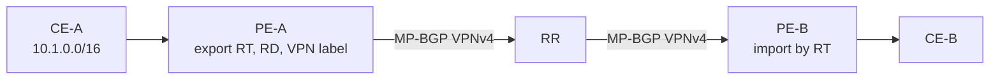

# MPLS L3VPN Control Plane

MPLS L3VPN separates **customer routing** (per VRF on PEs) from **provider transport** (core LSPs to PE loopbacks). MP-BGP carries VPN routes between PEs; the core never needs customer prefixes.

## Building blocks

| Component | Function |
|---|---|
| **VRF** | Per-customer routing table on PE |
| **PE-CE protocol** | eBGP, OSPF, EIGRP, RIP, static, connected |
| **RD** | Disambiguates identical customer prefixes in SP BGP |
| **RT** | Controls VRF import/export membership |
| **VPNv4/VPNv6 MP-BGP** | Distributes RD+prefix+label+RTs |
| **Transport** | LDP, RSVP-TE, SR-MPLS, BGP LU to PE next hop |
| **VPN label** | Identifies VRF/context at egress PE |

## Control-plane flow

CE-A originates a VRF prefix; PE-A exports it as VPNv4 (RD, RT, VPN label) via MP-BGP to the RR and onward to PE-B, which imports by RT and may advertise to CE-B.



Data plane: CE-B → PE-B pushes transport(+VPN) labels → core swap transport → PE-A pops → VRF lookup → CE-A.

## Session design

- iBGP VPNv4/VPNv6 among PEs, usually via RRs (often ADD-PATH for multihoming).
- PE-CE sessions live under `address-family ipv4/ipv6 vrf …`.
- Send extended communities on VPNv4 neighbors.

## Configuration sketch

### Cisco

```text
vrf definition CUST
 rd 65000:10
 route-target export 65000:100
 route-target import 65000:100
!
router bgp 65000
 neighbor 192.0.2.1 remote-as 65000
 address-family vpnv4
  neighbor 192.0.2.1 activate
  neighbor 192.0.2.1 send-community extended
 address-family ipv4 vrf CUST
  neighbor 198.51.100.2 remote-as 65001
  neighbor 198.51.100.2 activate
```

### Junos

```text
set routing-instances CUST instance-type vrf
set routing-instances CUST route-distinguisher 65000:10
set routing-instances CUST vrf-target target:65000:100
set protocols bgp group RR family inet-vpn unicast
```

## Interactions

| Topic | Link |
|---|---|
| RD / RT deep dive | [02](02_Route_Distinguishers.md), [03](03_Route_Target_Import_and_Export.md) |
| Labels | [04](04_VPN_Labels_and_Forwarding.md) |
| PE-CE AS tools | [08](08_PE_CE_AS_Loop_Toolkit.md), [SoO](07_Site_of_Origin.md) |
| allowas-in / as-override | [12/06](../12_eBGP_and_iBGP/06_AllowAS_In.md), [12/07](../12_eBGP_and_iBGP/07_AS_Override.md) |
| AIGP / seamless MPLS | [AIGP](../08_Path_Attributes/11_AIGP.md) |

## Verification

```text
show bgp vpnv4 unicast vrf CUST summary
show bgp vpnv4 unicast vrf CUST 10.1.0.0
show ip route vrf CUST 10.1.0.0
show mpls forwarding-table
ping vrf CUST 10.1.0.1
```

## Interview framing

“L3VPN control plane keeps customer routes in PE VRFs, distributes them with MP-BGP using RD/RT/labels, and relies on core transport only to PE next hops—not to customer prefixes.”

---
