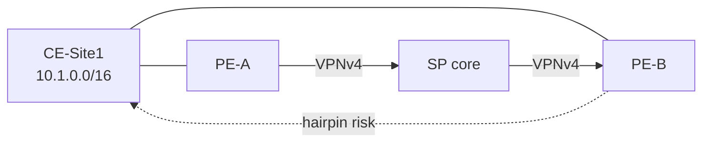
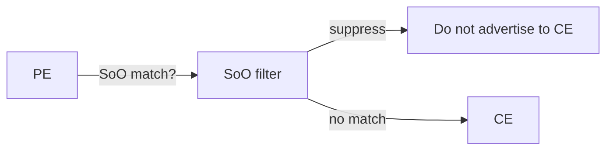

# Site-of-Origin (SoO)

Site-of-Origin is an BGP **extended community** (type often called Origin / SoO) that tags routes learned from a particular CE site. PEs use it to prevent a multihomed site from learning its own prefixes back through the provider backbone—an L3VPN loop-prevention tool that works even when AS_PATH loop detection is relaxed (`allowas-in` / `as-override`).

## Problem

CE-Site1 is dual-homed to PE-A and PE-B. Prefix `10.1.0.0/16` is learned from CE on PE-A, exported as VPNv4, and imported on PE-B. Without SoO, PE-B may advertise `10.1.0.0/16` back to the same CE site. The CE (or site IGP) can then prefer the VPN path over the local path, creating a loop or suboptimal hairpin through the SP core.



AS_PATH alone may not save you when:

- the site uses a private ASN that is overridden;
- allowas-in is enabled;
- redistribution into an IGP hides BGP AS_PATH from site routers.

## Mechanism

1. On the PE→CE (or VRF neighbor) attachment, configure a unique SoO value per site, e.g. `origin:65000:1001` or `origin:192.0.2.1:1`.
2. Routes learned **from that site** are tagged with that SoO when redistributed/advertised into MP-BGP.
3. When advertising from PE **to** a CE, the PE suppresses any route whose SoO matches the SoO configured for that CE attachment.



SoO is therefore a **per-site filter**, not a per-prefix password. Two sites must not share a SoO value.

## Relationship to RD and RT

| Attribute | Purpose |
|---|---|
| **RD** | Makes VPN prefixes unique in the SP BGP table. |
| **RT** | Controls which VRFs import which routes. |
| **SoO** | Prevents a site from accepting its own routes back from the VPN. |

RD/RT do not replace SoO for dual-homed CE loop prevention.

## Configuration patterns

### Cisco IOS XE

```text
route-map SET-SOO permit 10
 set extcommunity soo 65000:1001

router bgp 65000
 address-family ipv4 vrf CUST-A
  neighbor 192.0.2.10 remote-as 65001
  neighbor 192.0.2.10 activate
  neighbor 192.0.2.10 as-override
  neighbor 192.0.2.10 route-map SET-SOO in
  neighbor 192.0.2.10 site-of-origin 65000:1001
 exit-address-family
```

Some releases use `neighbor … site-of-origin` directly; others rely on inbound `set extcommunity soo`. Use one consistent method per platform train.

### Junos

```text
set policy-options community SOO-SITE1 members origin:65000:1001
set policy-options policy-statement CE-IN term 1 then community add SOO-SITE1
set protocols bgp group CE-SITE1 import CE-IN
set protocols bgp group CE-SITE1 neighbor 192.0.2.10
set routing-instances CUST-A protocols bgp group CE-SITE1 vrf-export …
```

Ensure the export policy toward that CE rejects routes carrying `SOO-SITE1`.

## Interactions with allowas-in and as-override

Same-ASN hub-and-spoke or dual-homed designs commonly need:

1. **as-override** or **allowas-in** so AS_PATH does not drop inter-site routes;
2. **SoO** so intra-site routes are not fed back into the site.

Enabling (1) without (2) is a frequent lab and production loop recipe.

## Verification

```text
show bgp vpnv4 unicast vrf CUST-A <prefix>
! Extended Community: SoO:65000:1001
show bgp vpnv4 unicast vrf CUST-A neighbors 192.0.2.10 advertised-routes
! Site-local prefixes must be absent
```

From the CE, confirm local site prefixes are learned via site IGP/connected, not via BGP from the PE.

## Design rules

- One SoO per site attachment complex (all PEs facing that site share the same SoO for that site).
- Distinct sites → distinct SoO values.
- Document SoO in the VRF design pack beside RD/RT.
- Do not reuse SoO values after site decommission until tables are flushed.

## Cross-links

- [allowas-in](../12_eBGP_and_iBGP/06_AllowAS_In.md)
- [as-override](../12_eBGP_and_iBGP/07_AS_Override.md)
- [local-as](../12_eBGP_and_iBGP/08_Local_AS.md)
- [next-hop-unchanged](../12_eBGP_and_iBGP/09_Next_Hop_Unchanged.md)
- [PE-CE AS-Loop Toolkit](08_PE_CE_AS_Loop_Toolkit.md)

## Interview framing

“SoO is an extended community that marks which CE site a route came from so PEs can refuse to advertise that route back to the same site—essential when as-override or allowas-in weakens AS_PATH loop detection.”

---
