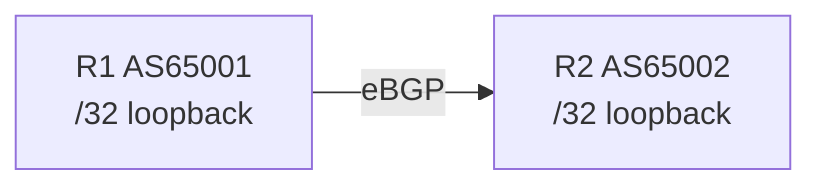

# Lab: Basic eBGP Origination

## Topology

R1 (AS 65001) —— R2 (AS 65002), direct eBGP, IPv4 unicast.



## Objectives

- Establish eBGP with explicit import/export prefix policy.
- Originate one loopback /32 from each AS; observe AS_PATH prepend on receipt.
- Capture OPEN/KEEPALIVE/UPDATE and decode attributes.

## Config touchpoints

```text
router bgp 65001
 neighbor 192.0.2.2 remote-as 65002
 address-family ipv4
  network 203.0.113.1 mask 255.255.255.255
  neighbor 192.0.2.2 activate
  neighbor 192.0.2.2 route-map IN in
  neighbor 192.0.2.2 route-map OUT out
```

Exact `network` statement requires a matching RIB route.

## Tasks

1. Configure addresses, ASN, and default-deny policies with exact permits.
2. Originate loopbacks; confirm Established and family negotiation.
3. Compare received / accepted / installed / advertised views.
4. Capture TCP 179; decode first UPDATE (AS_PATH, NEXT_HOP, ORIGIN).

## Failure injection

Remove R1’s loopback route (or `network` match). Session stays Established; advertisement withdraws.

## Expected evidence

Peer shows AS_PATH `65001` for R1’s /32; CEF installed; withdrawal removes RIB entry without session reset.

---
