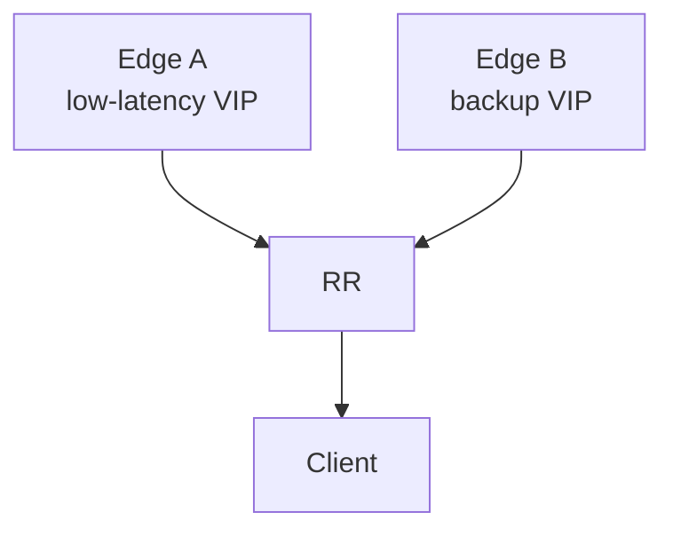

# Lab: Route Reflection and Path Hiding

## Topology

Two edges (A low-latency, B backup) + one RR + one client. Both edges advertise the same VIP to the RR.



## Objectives

- Observe client receiving only the RR’s best path.
- Change LP so RR prefers A; confirm client follows.
- Optionally enable ADD-PATH so client sees both.

## Config touchpoints

```text
neighbor <client> route-reflector-client
! ADD-PATH (platform-specific):
neighbor <client> capability additional-paths send
neighbor <client> advertise additional-paths best 2
```

## Tasks

1. With default attributes, note which edge the RR selects and what the client installs.
2. Set LP so the other edge wins on RR; refresh; confirm client updates.
3. Enable ADD-PATH; confirm two paths on client.

## Failure injection

Give edges equal LP and manipulate RID/IGP so RR hides the path you wanted for latency—document the surprise.

## Expected evidence

Without ADD-PATH, client path count = 1. With ADD-PATH, path count ≥ 2. Matches [RR case](../24_Practical_Cases/03_Route_Reflector_Hides_Low_Latency_Path.md).
## Cross-links

Use the matching troubleshooting or interview note if this case appears in an incident; keep evidence (show output + probe) with the ticket.

---
