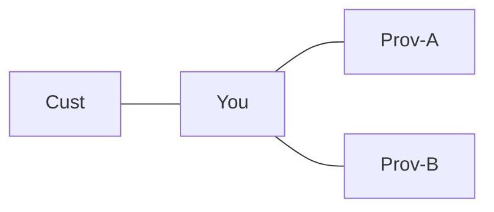

# Lab: Import/Export Policy and Route Leak

## Topology

Cust —— You —— Prov-A and Prov-B. You learn full table from A; accidentally export it to B.



## Objectives

- Create a leak; observe advertised count and transit traceroute.
- Fix with outbound prefix/community policy (customer+own only).
- Optionally mark OTC / roles and show peer rejection.

## Config touchpoints

```text
route-map TO-PROV-B permit 10
 match ip address prefix-list CUST-AND-OWN
route-map TO-PROV-B deny 100
neighbor <B> route-map TO-PROV-B out
```

## Tasks

1. Baseline advertised counts to A and B.
2. Permit-all outbound to B; watch count explode; traceroute third-party pair via you.
3. Restore strict export; soft-out; confirm baseline.

## Failure injection

Export only “no-export” communities incorrectly stripped—document another leak class.

## Expected evidence

Leak = foreign prefixes in `advertised-routes` to B. Fix restores counts. See [leak case](../24_Practical_Cases/07_Route_Leak_Creates_Unintended_Transit.md).
## Cross-links

Use the matching troubleshooting or interview note if this case appears in an incident; keep evidence (show output + probe) with the ticket.

---
