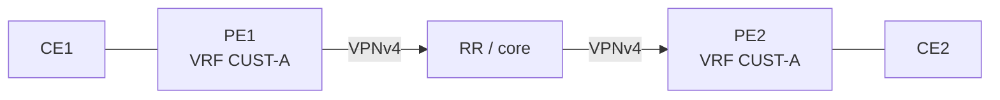

# Lab: MP-BGP VPN Route Targets

## Topology

CE1 —— PE1 —— (VPNv4 RR/core) —— PE2 —— CE2. VRF CUST-A on both PEs.



## Objectives

- Export/import RT so CE1↔CE2 reachability works.
- Break import RT and show VPNv4 present in bgp.l3vpn but absent in VRF.
- Add SoO + as-override or allowas-in for same-ASN CE sites ([toolkit](../18_MPLS_L3VPN/08_PE_CE_AS_Loop_Toolkit.md)).

## Config touchpoints

```text
vrf definition CUST-A
 rd 65000:1
 route-target export 65000:100
 route-target import 65000:100
! PE-CE:
neighbor <CE> remote-as 65001
neighbor <CE> as-override
neighbor <CE> site-of-origin 65000:1001
```

## Tasks

1. Verify VPNv4 prefix with RT and label; VRF install; CE ping.
2. Remove import RT on PE2; show control-plane vs VRF miss.
3. Dual-home one site; prove SoO blocks site feedback.

## Expected evidence

RT mismatch ⇒ no VRF route. SoO ⇒ site prefixes absent from PE→CE advertised-routes.
## Cross-links

Use the matching troubleshooting or interview note if this case appears in an incident; keep evidence (show output + probe) with the ticket.

---
