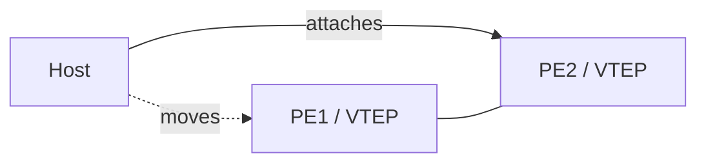

# Lab: EVPN MAC Mobility

## Topology

Two VTEPs/PEs in same EVPN VNI/VLAN; host moves from PE1 to PE2 (or dual-attach then move).



## Objectives

- Observe Type-2 MAC/IP routes and sequence number / mobility community behavior.
- Show old PE withdraw or lose best after move.
- Confirm data-plane updates (ARP/ND suppression interactions optional).

## Config touchpoints

Platform EVPN MAC VRF / VNI config; BGP L2VPN EVPN address-family between PEs/RR.

```text
show bgp l2vpn evpn <mac>
show evpn mac <mac>    ! vendor-specific
```

## Tasks

1. Learn MAC on PE1; document sequence and next hop.
2. Move host to PE2; capture mobility update.
3. Verify PE1 no longer owns forwarding for that MAC.

## Failure injection

 asymmetric move detection delay—measure blackhole window.

## Expected evidence

Higher sequence wins; traffic follows new VTEP. See [MAC Mobility](../19_EVPN/05_MAC_Mobility.md).
## Cross-links

Use the matching troubleshooting or interview note if this case appears in an incident; keep evidence (show output + probe) with the ticket.

---
