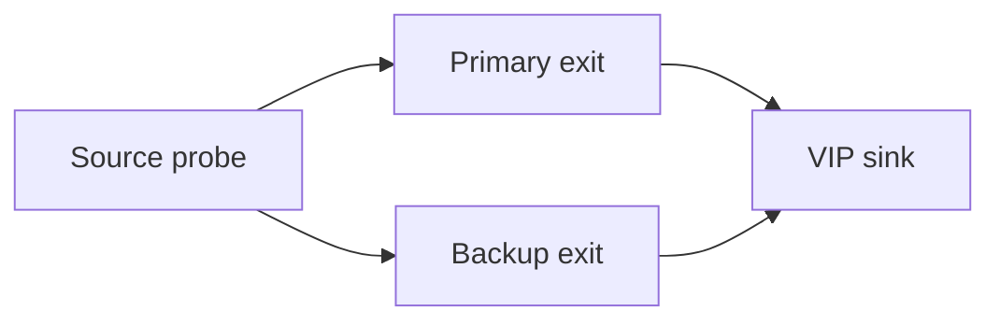

# Lab: Measure BGP Failover Loss

## Topology

Primary and backup eBGP/iBGP exits toward a VIP sink. Continuous probe (icmp/udp/twamp) from source.



## Objectives

- Quantify packet-loss interval for: interface shut, BFD-triggered BGP, and process restart (GR on/off).
- Compare to business SLO—not to “session reconverged” time alone.
- Add PIC/preinstall if platform supports; re-measure.

## Config touchpoints

```text
neighbor <primary> fall-over bfd
! LP primary 300 / backup 100
! Optional: BGP PIC edge
```

## Tasks

1. Baseline steady-state loss = 0.
2. Fail primary link; timestamp first/last lost probe; note new NH.
3. Repeat with slower Hold-only detection vs BFD.
4. Plot loss interval vs detection method.

## Failure injection

Oscillate BFD ([case](../24_Practical_Cases/12_Fast_BFD_Causes_Path_Oscillation.md)); show loss from churn exceeds single-fail loss.

## Expected evidence

Numeric loss duration per method; backup NH and FIB update timestamps recorded. Ties to [Fast failover vs stability](../22_Quant_Trading_Networks/05_Fast_Failover_vs_Stability.md).
## Cross-links

Use the matching troubleshooting or interview note if this case appears in an incident; keep evidence (show output + probe) with the ticket.

---
