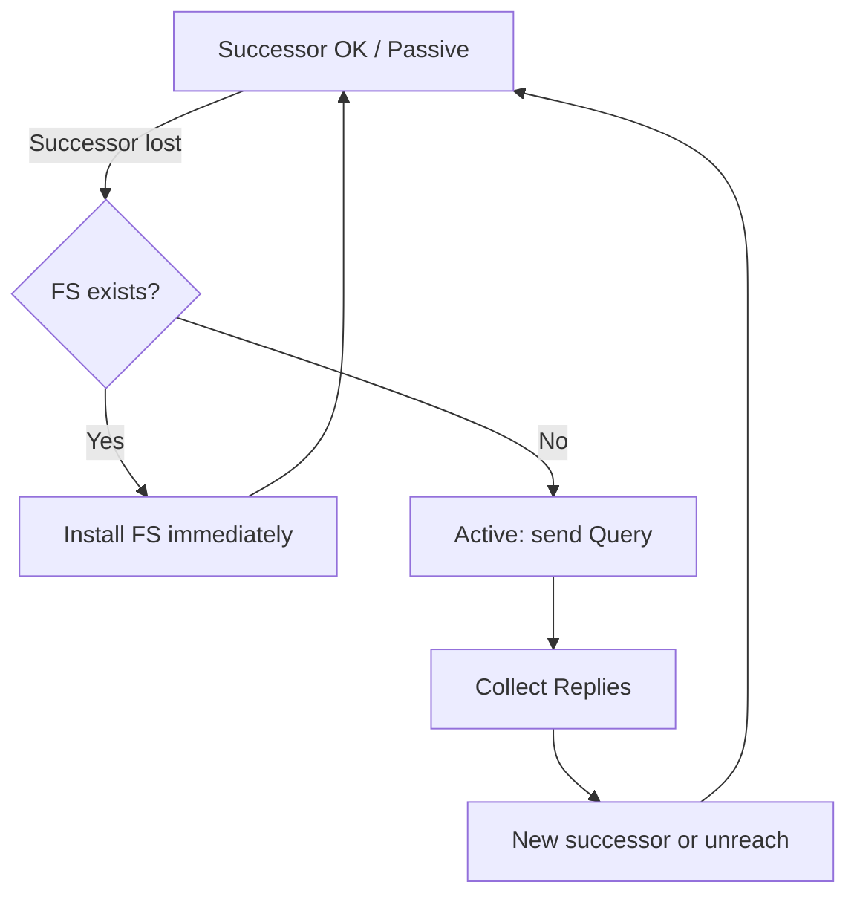

# Advanced distance vector

Marketing once called EIGRP a “hybrid” of distance-vector and link-state. That label confuses operators. **EIGRP remains a distance-vector protocol**: a router learns destinations and metrics **from neighbors**, not by flooding every link’s state into a shared LSDB and running SPF on the full graph.

What is “advanced” is the control plane around that DV core: **triggered, partial updates**, **Reliable Transport Protocol (RTP)**, and **DUAL** for loop-free selection and coordinated search (queries) when the best path fails.

## Distance-vector core (unchanged)

```text
Neighbor advertises: "I can reach P with metric M (reported distance)"
Local computes: FD candidates via each neighbor
DUAL installs successor if loop-free rules satisfied
```

You do **not** receive every remote router’s interface database. The topology table holds **paths known through neighbors** for prefixes of interest—not an OSPF-style LSDB of the entire AS.

## What looks “link-state-like” (and what it is not)

| Behavior | EIGRP reality | Link-state contrast |
|---|---|---|
| Fast reaction to change | Triggered Updates/Queries | LSA/LSP flood + SPF |
| Partial information | Only affected prefixes | Still floods link state |
| Loop prevention | Feasibility condition + Active | SPF on consistent LSDB |
| Topology visibility | Neighbor-centric paths | Full graph (within area/level) |

Related: [What EIGRP is](01_What_EIGRP_Is.md), [Topology table entries](../06_Topology_Table_and_RIB/02_Topology_Table_Entries.md).

## DUAL in one diagram



Queries are **not** “mini LSA floods.” They are DV searches for an alternate path, and they can **propagate** until stub/summary/design bounds them—or until SIA.

## Configuration patterns (seeing DV updates)

### Cisco IOS / IOS XE

```text
debug eigrp packets update query reply
show ip eigrp topology all-links
! all-links shows paths that failed feasibility—still DV entries, not LSAs
```

No Junos/FRR focus here: the misconception is Cisco-curriculum driven.

## Verification

```text
show ip eigrp topology
show ip eigrp topology all-links
show ip eigrp traffic
```

Lab checks:

1. Change a leaf metric; confirm **partial** Update, not full-table refresh.
2. Compare `topology` vs `all-links`: successors/FS vs infeasible paths.
3. Pull successor without FS; capture Query propagation hop count before stub.

## Risks

- Designing as if every router has full topology → wrong troubleshooting and TE assumptions.
- Assuming queries are “cheap SPF” → unbounded query domains and SIA.
- Teaching “hybrid” in interviews without correcting to advanced DV + DUAL.

## Interview framing

“EIGRP is still distance-vector: neighbors advertise destinations and metrics; DUAL and RTP make it advanced—there is no OSPF-style LSDB flood, only partial updates and queries.”

---
