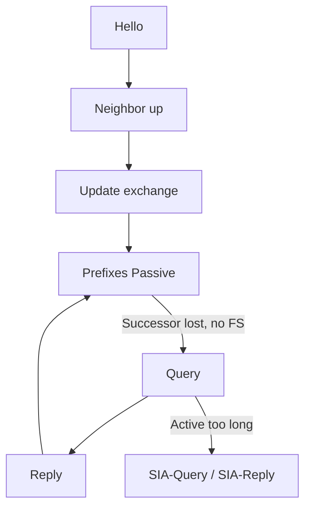

# Packet types overview

EIGRP defines a small set of packet types. Knowing which are reliable, which are multicast, and which drive DUAL state transitions is the fastest way to read `debug eigrp packets` and traffic counters under pressure.

## Packet catalog

| Type | Role | Typical reliability | Typical addressing |
|---|---|---|---|
| **Hello** | Discover/maintain neighbors; carry Hold/K-values | Unreliable | Multicast (or unicast static) |
| **Update** | Advertise/withdraw routing information | Reliable when needed | Multicast/unicast |
| **Query** | Ask neighbors for alternate path (Active) | Reliable | Multicast/unicast |
| **Reply** | Answer a Query | Reliable | Unicast to querier |
| **ACK** | Acknowledge reliable packet | — | Unicast |
| **SIA-Query** | Ask if neighbor still working an Active prefix | Reliable | Unicast |
| **SIA-Reply** | Affirm progress / status for SIA-Query | Reliable | Unicast |

Older references also mention **Request** packets; modern ops focus on the table above. Related: [Hello and Hold](03_Hello_and_Hold.md), [Query and Reply](05_Query_and_Reply.md), [SIA-Query and SIA-Reply](07_SIA_Query_and_SIA_Reply.md).

## DUAL-oriented flow



## Conditional updates vs queries

- **Update**: “Here is reachability/metric change” (or initial exchange).
- **Query**: “I lost my successor; do you have a loop-free alternative?”
- **Reply**: “My answer for that destination is …” (including infinite/unreachable).

Confusing Update with Query leads to wrong stub/summary design conclusions.

## Configuration patterns (observation)

### Cisco IOS / IOS XE

```text
show ip eigrp traffic
debug eigrp packets hello update query reply ack
undebug all
```

Named:

```text
show eigrp address-family ipv4 traffic
```

## Verification lab

1. Steady state: Hellos dominate; Updates rare.
2. Link metric change: Updates, not Queries, if successor remains.
3. Kill successor without FS: Queries + Replies; watch Active flag.
4. Stretch Active: SIA-Query appear before neighbor reset.

## Risks

- Filtering “unnecessary” EIGRP types in a firewall middlebox.
- Assuming Hello reliability—lost Hellos only matter via Hold expiry.
- Ignoring ACK failures when Updates seem “sent” in debug.

## Interview framing

“EIGRP’s core types are Hello, Update, Query, Reply, and ACK, plus SIA-Query/Reply—Updates move topology; Queries search when DUAL goes Active; RTP ACKs protect the reliable ones.”

---
