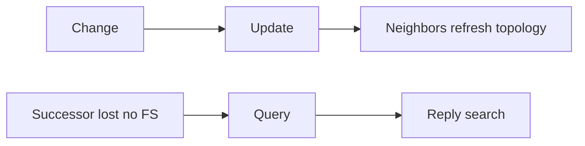

# Update packets

**Update** packets carry EIGRP routing information: destinations, metrics, and related TLVs. Updates are **event-driven** and **partial**—only prefixes that need advertising change are sent, not a periodic full-table dump like classic RIP. When reliability is required, RTP ensures delivery with sequence numbers and ACKs.

## Bounded and partial

| Property | Meaning |
|---|---|
| Partial | Only affected destinations |
| Bounded | Scoped by neighbors, stub, split horizon, summarization |
| Reliable | Retransmit until ACK (or give up / neighbor down) |
| Initial exchange | After adjacency, Updates populate topology |

```text
Link metric change on path to P
  -> Update for P (and dependents), not entire table
New neighbor
  -> Updates to synchronize needed prefixes
```

Related: [Advanced distance vector](../02_Fundamentals/03_Advanced_Distance_Vector.md), [Query and Reply](05_Query_and_Reply.md).

## Update versus Query



Do not call every EIGRP message an “update.” Queries are a different DUAL mechanism.

## Split horizon and stub effects

- **Split horizon**: do not advertise a prefix back out the interface used to learn it (with poison reverse variants in play on some designs).
- **Stub**: leaf may advertise only connected/summary/static/redistributed subsets—core sees fewer Updates from stub peers and should not Query them for transit.

## Configuration patterns

### Cisco IOS / IOS XE

```text
router eigrp 100
 network 10.0.0.0 0.255.255.255
 distribute-list PREFIX out GigabitEthernet0/1
!
ip prefix-list PREFIX permit 10.10.0.0/16 le 32
```

### Named stub (limits what is advertised / queried)

```text
router eigrp CAMPUS
 address-family ipv4 unicast autonomous-system 100
  eigrp stub connected summary
```

## Verification

```text
show ip eigrp traffic
show ip eigrp topology
debug eigrp packets update
```

Lab checks:

1. Change delay on one interface; capture Update for affected prefixes only.
2. Form new neighbor; count initial Updates.
3. Enable stub on leaf; confirm core does not expect full transit Updates.

## Risks

- Filters that drop Updates but allow Hellos → “neighbor up, no routes.”
- Expecting full topology visibility from Updates alone (`all-links` still only neighbor-advertised paths).
- Large dual-homed flaps causing Update storms without summarization.

## Interview framing

“EIGRP Updates are partial, event-driven advertisements of destinations and metrics—reliable when needed—and they are not the same as DUAL Queries used when a successor is lost without an FS.”

---
