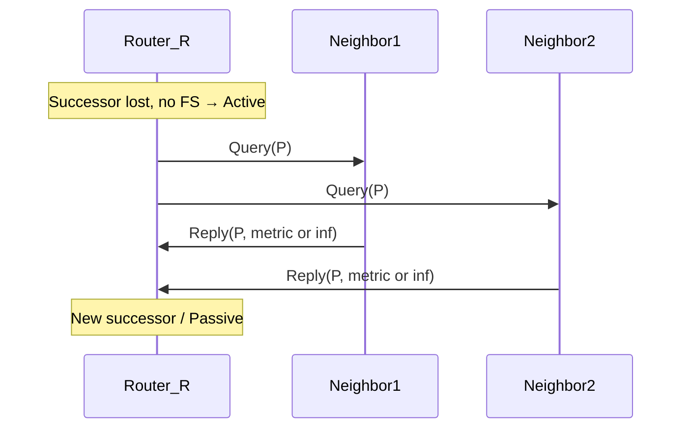

# Query and Reply

When a router loses its **successor** for a prefix and has **no feasible successor**, DUAL marks the route **Active** and sends **Query** packets to neighbors asking for an alternate path. Neighbors **Reply** with their distance information (including unreachable). The querier collects Replies, computes a new successor (or declares unreach), and returns to **Passive**.

## Sequence



Queries propagate: a neighbor that also lacks a loop-free answer may Query *its* neighbors before Replying—this is the **query domain**. Stub and summarization exist largely to **bound** that domain. Related: [Passive versus Active routes](../06_Topology_Table_and_RIB/04_Passive_vs_Active_Routes.md), [SIA-Query and SIA-Reply](07_SIA_Query_and_SIA_Reply.md).

## Rules of thumb

| Situation | Behavior |
|---|---|
| FS present | Install FS; **no Query** for that prefix |
| No FS | Active + Query |
| Stub neighbor | Should not be queried as transit in proper designs |
| Summary hides specifics | Query may stop at summary boundary |

## Configuration patterns (bounding queries)

### Cisco IOS / IOS XE

```text
router eigrp 100
 eigrp stub connected summary
!
interface GigabitEthernet0/0
 ip summary-address eigrp 100 10.10.0.0 255.255.0.0
```

Named mode: stub under AF; summary under `af-interface` as applicable.

## Verification

```text
show ip eigrp topology | include Active
show ip eigrp topology 10.10.10.0/24
show ip eigrp traffic
debug eigrp packets query reply
```

Lab checks:

1. Dual-homed leaf with FS: shut primary; **zero** Queries for that prefix.
2. Remove FS path; shut successor; capture Query fan-out.
3. Add stub on far leaf; confirm queries do not wait on it incorrectly.

## Risks

- Large query domains → **SIA** and cascading Active.
- Stub misconfigured as `receive-only` unexpectedly → missing advertisements.
- Clearing neighbors during Active → longer pain, lost evidence.

## Interview framing

“With no feasible successor, EIGRP goes Active and Queries neighbors; Replies finish the search—stub and summarization exist to keep that query domain finite.”

---
