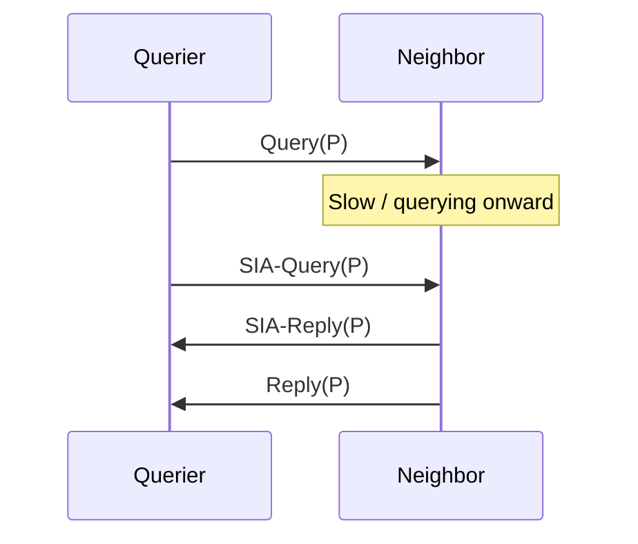

# SIA-Query and SIA-Reply

**Stuck-In-Active (SIA)** occurs when a router remains **Active** for a prefix longer than the Active timer allows because outstanding **Queries** were not answered in time (slow neighbor, huge query domain, packet loss, or a neighbor that itself is Active waiting). Before resetting relationships, EIGRP uses **SIA-Query** and **SIA-Reply** to probe whether a neighbor is still progressing.

## Role in the Active lifecycle

```text
Active: Query sent, waiting for Replies
  -> Active timer getting long
  -> SIA-Query to unresponsive neighbor
  -> SIA-Reply: neighbor still working / status
  -> eventually: Reply arrives OR neighbor reset / SIA declared
```

SIA is primarily a **design and failure-domain** symptom: unbounded queries, missing stub, flapping links, or overloaded control planes—not a random cosmetic log line. Related: [Query and Reply](05_Query_and_Reply.md), [Passive versus Active routes](../06_Topology_Table_and_RIB/04_Passive_vs_Active_Routes.md).

## Sequence sketch



## Operational response

| Step | Action |
|---|---|
| 1 | Identify Active prefixes and which neighbor has not replied |
| 2 | Check that neighbor’s CPU, links, and whether *it* is Active |
| 3 | Fix design: stub leaves, summarize, reduce query fan-out |
| 4 | Avoid blind `clear ip eigrp neighbors` as first step |

## Configuration patterns (prevention > cure)

### Cisco IOS / IOS XE

```text
router eigrp 100
 eigrp stub connected summary
!
interface GigabitEthernet0/0
 ip summary-address eigrp 100 10.0.0.0 255.255.0.0
```

Active-time may be tunable on some trains; prefer bounding queries over raising timers as a habit.

## Verification

```text
show ip eigrp topology active
show ip eigrp topology | include Active|SIA
show log | include Stuck|SIA
debug eigrp packets siaquery siareply query reply
```

Lab: build a deep chain without stub; withdraw a leaf prefix; watch Active and SIA messages; then add stub/summary and repeat.

## Risks

- Treating SIA as “clear neighbors” runbook forever.
- Raising Active timers to hide bad query domains.
- Stub omitted on access layers in large campuses.

## Interview framing

“SIA means an Active Query waited too long; SIA-Query/Reply probe hung neighbors—but the real fix is bounding the query domain with stub and summarization, not ritual clears.”

---
