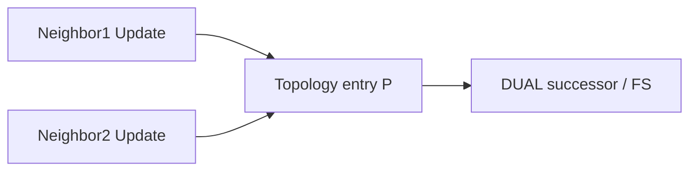

# Topology table entries

Each **topology table** entry describes a destination prefix and the set of paths EIGRP knows via neighbors: reported distances, computed metrics, outgoing interfaces, and DUAL state. It is the working database for successor selection—not a map of every link in the AS.

## Entry contents (conceptual)

```text
P 10.10.10.0/24, 1 successors, FD is 3072
        via 10.1.1.2 (3072/2816), GigabitEthernet0/0
        via 10.2.2.2 (3328/2816), GigabitEthernet0/1
```

| Piece | Meaning |
|---|---|
| Prefix | Destination |
| successors count | How many successors DUAL installed candidates |
| FD | Feasible distance |
| via N (A/B) | Neighbor N; A = local metric via N; B = RD from N |
| State | Passive / Active (in detailed views) |

Related: [Successor and feasible successor](03_Successor_and_Feasible_Successor.md), [Reading show EIGRP topology](06_Reading_Show_EIGRP_Topology.md).

## What is included / excluded

| Included | Excluded |
|---|---|
| Paths advertised by neighbors | Remote routers’ full interface LSDB |
| Local originated / connected injections | Arbitrary non-EIGRP routes (until redistributed in) |
| Infeasible paths in `all-links` | Guaranteed visibility of alternate physical paths never advertised |



## Configuration patterns

### Cisco IOS / IOS XE

```text
show ip eigrp topology
show ip eigrp topology 10.10.10.0/24
show ip eigrp topology all-links
```

`all-links` is essential to see paths that failed `RD < FD` and thus are neither successor nor FS.

## Verification lab

1. Build triangle; identify which via lines are FS vs hidden infeasible.
2. Change delay so an infeasible path becomes feasible; watch it appear in default topology view.
3. Compare topology entry to RIB next hop.

## Risks

- Believing topology lists every possible backup in the physical graph.
- Ignoring `all-links` when explaining “why no FS.”
- Mixing FD display with RD in the `(metric/RD)` pair.

## Interview framing

“The EIGRP topology table holds neighbor-advertised paths to prefixes for DUAL—not a full LSDB—and `all-links` reveals infeasible paths that failed RD < FD.”

---
