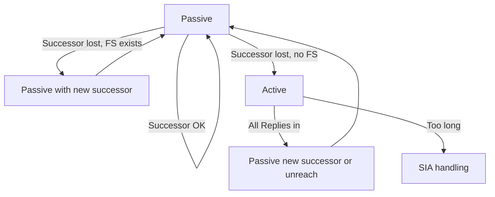

# Passive versus Active routes

In EIGRP, **Passive** and **Active** are **DUAL states for a prefix** in the topology table—not interface passive mode and not BGP FSM Active.

| State | Meaning |
|---|---|
| **Passive** | Stable: successor known; not awaiting Query answers |
| **Active** | Computing: successor lost without FS (or recomputing); Queries outstanding |

Related: [Query and Reply](../04_Packets_and_Transport/05_Query_and_Reply.md), [SIA-Query and SIA-Reply](../04_Packets_and_Transport/07_SIA_Query_and_SIA_Reply.md), [Passive interfaces](../05_Neighbor_Discovery/05_Passive_Interfaces.md).

## State machine (prefix-centric)



## Ops implications

- Hundreds of Active prefixes after a core cut → query-domain design problem.
- One Active prefix during maintenance → often expected; watch duration.
- Passive in topology ≠ installed in RIB (AD competition).

## Configuration patterns (reduce Active events)

```text
router eigrp 100
 eigrp stub connected summary
!
interface GigabitEthernet0/0
 ip summary-address eigrp 100 10.0.0.0 255.255.0.0
```

Ensure FS where dual-homing matters (metric planning).

## Verification

```text
show ip eigrp topology | include Active
show ip eigrp topology active
show log | include Active|Stuck
```

Lab: create Active deliberately; measure time to Passive; then add FS and repeat for zero Active.

## Risks

- Saying “EIGRP is Active” when you mean passive-interface.
- Leaving the network in chronic micro-Active from flapping leaf links without stub.
- Ignoring Active while staring only at `show ip route`.

## Interview framing

“Passive means DUAL is stable with a successor; Active means EIGRP is querying after losing the successor without an FS—totally different from passive-interface.”

---
