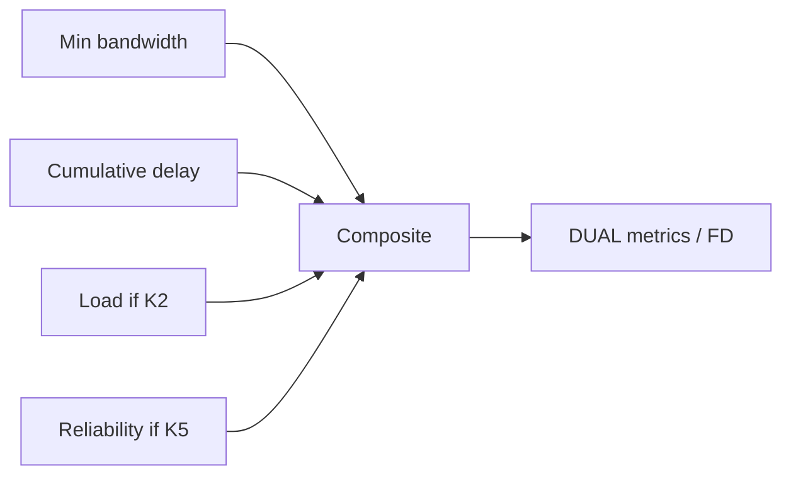

# Composite metric formula

Classic EIGRP computes a **composite metric** from interface attributes weighted by **K-values** (K1–K5). With default weights, only **bandwidth** and **delay** matter. The scaled formula operators memorize for classic EIGRP is:

```text
metric = [(K1 * BW_term + K2 * BW_term / (256 - load) + K3 * Delay_term) * K5 / (K4 + reliability)] * 256
```

When **K5 = 0** (default), the `K5/(K4+rel)` term is treated as **1** (not multiply-by-zero). Defaults: **K1 = 1, K2 = 0, K3 = 1, K4 = 0, K5 = 0**.

## Default-reduced form

```text
metric = (BW_term + Delay_term) * 256

BW_term    = 10^7 / min_path_bandwidth_kbps
Delay_term = sum_of_delays_tens_of_microseconds
```

Related: [Bandwidth and delay components](02_Bandwidth_and_Delay_Components.md), [Metric calculation worked example](07_Metric_Calculation_Worked_Example.md).

## K-value roles

| K | Component |
|---|---|
| K1 | Bandwidth |
| K2 | Load |
| K3 | Delay |
| K4 / K5 | Reliability scaling pair |



## Configuration patterns

### Cisco IOS / IOS XE

```text
router eigrp 100
 metric weights 0 1 0 1 0 0
! TOS byte (first arg) historically 0; then K1..K5
```

Named mode sets metric weights under the address-family.

Do not enable K2/K4/K5 casually—metrics become unstable with load/reliability churn and **all neighbors must match K-values**.

## Verification

```text
show ip protocols
show ip eigrp topology 10.10.10.0/24
show interfaces GigabitEthernet0/0 | include BW|DLY
```

## Risks

- Non-default K-values without network-wide change control.
- Comparing classic metric to wide-metric displays.
- Forgetting the final `* 256` scaling in hand math.

## Interview framing

“Classic EIGRP’s default composite is essentially (bandwidth term + delay term) × 256 with K1=K3=1—other K-values are usually zero and must match on every neighbor if changed.”

---
