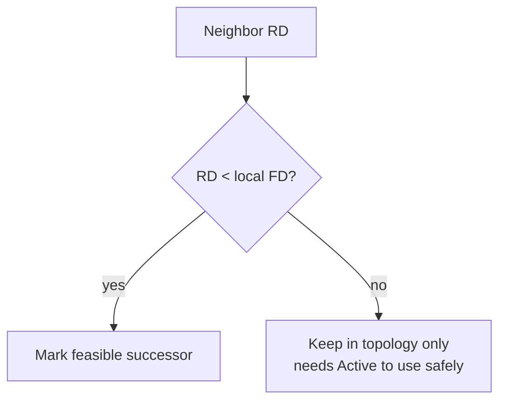

# Feasibility condition

The **feasibility condition (FC)** is the loop-freedom test DUAL applies before trusting a neighbor as a backup (or alternate) next hop:

\[
\text{RD}_{\text{neighbor}}(\text{dest}) < \text{FD}_{\text{local}}(\text{dest})
\]

If a neighbor’s reported distance is **strictly less** than this router’s feasible distance, that neighbor is a **feasible successor** (FS) for the destination (assuming the path is otherwise usable).

## Proof intuition

Suppose router R has FD = *d* to destination D via successor S. Neighbor N reports RD = *r* with *r* &lt; *d*.

If N’s best path to D went through R, then N’s distance would be at least  
`cost(N→R) + d` ≥ *d* (costs are non-negative). So N could not report *r* &lt; *d* while depending on R. Therefore N’s path to D does **not** rely on R, and R can safely forward to N without forming an immediate loop through itself.

```text
R --(successor)--> S ----> D     FD(R) = d
R --(candidate)--> N ----> D     RD(N) = r

If r < d, N is not using R to reach D → FC pass → loop-free alternate
```

FC is **sufficient** for loop freedom, not **necessary**. A neighbor with RD ≥ FD might still be loop-free in the real graph, but DUAL will **not** promote it to FS without a diffusing computation. That conservatism is why some unequal-cost paths never get used until variance *and* FC both allow them—or until Active/query finds a new successor.

## What FC does not check

- Equal-cost: RD &lt; FD is strict; RD == FD fails FC (neighbor is not an FS). Equal-cost multipath uses multiple successors with equal local metrics, not “RD equals FD.”
- Policy filters: distribute-lists can hide paths that would have passed FC.
- Stub/query scope: FC is local selection logic; stubs affect whether queries are sent/answered.

## Ops checklist

1. Identify FD from topology entry.
2. For each alternate `via`, read inner metric (RD).
3. Ask: `RD < FD`? Yes → eligible FS / UCMP candidate (if variance allows). No → only usable after Active or if it becomes equal-cost successor.

```text
show ip eigrp topology 192.0.2.0/24
```



## Common numeric trap

Successor metric/FD = 100. Alternate local metric = 90 looks “better” but if that neighbor’s **RD = 100**, FC fails (`100 < 100` false). You cannot install it as FS; something is inconsistent or you need diffusion. Never compare only outer metrics when judging loop freedom.

## Interview framing

State the inequality first, then the one-sentence proof: “If the neighbor were looping through me, its RD could not be better than my FD.” Mention that FC is sufficient but not necessary—missed alternates may still exist.

## Related

- [Reported distance and feasible distance](02_Reported_Distance_and_Feasible_Distance.md)
- [Feasible successor and local repair](05_Feasible_Successor_and_Local_Repair.md)
- [Variance unequal cost](../12_Load_Balancing/02_Variance_Unequal_Cost.md)

---
