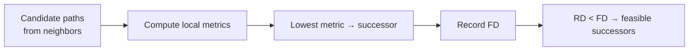

# Successor selection

The **successor** is the neighbor that provides the best (lowest composite metric) loop-free path to a destination. EIGRP installs the successor’s next hop into the RIB (subject to administrative distance and RIB policy). Multiple equal-metric successors yield ECMP.

## Selection algorithm (steady Passive)

1. For each neighbor advertising the destination, compute **local metric** = cost through that neighbor.
2. Discard paths that fail filters / next-hop reachability / AF rules.
3. Choose the path(s) with the **lowest local metric** as successor(s).
4. Set **FD** to that successor metric.
5. Mark other neighbors with `RD < FD` as **feasible successors**; keep them in the topology table for local repair / UCMP.



## Topology table vs RIB vs FIB

| Table | Role |
|---|---|
| **Topology (EIGRP)** | All known paths, RD/FD, Passive/Active state, FS list |
| **RIB** | Best route(s) EIGRP offers to the routing table; may lose to lower AD protocols |
| **FIB/CEF** | Forwarding after RIB install; ECMP/UCMP share among installed next hops |

Losing the RIB entry (e.g. floating static with better AD) does not always clear topology knowledge the same way a neighbor failure does—verify both planes when troubleshooting “route missing.”

## Tied metrics

If two neighbors yield the same local metric, both are successors (up to `maximum-paths`). Each has the same metric as FD. Feasibility for *additional* worse paths still uses `RD < FD`.

## Classic vs named verification

```text
! Classic
show ip eigrp topology
show ip route eigrp
show ip eigrp topology | section 10.1.0.0

! Named
show eigrp address-family ipv4 topology
show eigrp address-family ipv4 neighbors
show ip route eigrp
```

Successor appears as the path whose local metric equals FD (and is counted in “N successors”).

## Configuration knobs that change the winner

- Interface `bandwidth` / `delay` (primary metric levers with default K-values)
- `metric weights` (K-values)—must match AS-wide
- Offset lists, route-maps, summarization (change advertised metric or prefix)
- `variance` / `maximum-paths` (do not change who *is* successor; change how many next hops install)

## Risks

- Tuning delay on one link to “force” a successor without documenting FD/FS impact breaks expected local repair.
- Unequal AD or redistribution can make EIGRP’s successor unused in the RIB while topology still shows Passive.

## Interview framing

“Successor = lowest local metric path; FD = that metric; FS = other neighbors with RD &lt; FD. Topology holds candidates; RIB holds what forwarding uses.”

## Related

- [Feasible successor and local repair](05_Feasible_Successor_and_Local_Repair.md)
- [Equal-cost multipath](../12_Load_Balancing/01_Equal_Cost_Multipath.md)
- [Topology table](../06_Topology_Table_and_RIB/README.md)

---
