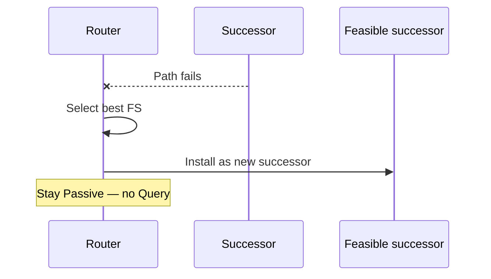

# Feasible successor and local repair

A **feasible successor (FS)** is a loop-free alternate next hop already stored in the topology table: it passes the feasibility condition (`RD < FD`) but was not chosen as successor because its local metric is worse (or was not needed for ECMP).

## Local repair (no query)

When the successor is lost or its metric worsens such that another FS is better:

1. DUAL promotes the best FS to successor.
2. FD updates to the new successor metric.
3. Prefix remains **Passive**.
4. **No Query** is sent for that destination.

This is the operational win of keeping FS entries warm in the topology table: failover is local and typically sub-second from a control-plane perspective (detection time still depends on hello/hold, BFD, or link down).



## What must already be true

- Neighbor relationship to the FS still up.
- Prefix still advertised by that neighbor (not filtered away).
- After failure, recomputed metrics still leave an FS with `RD <` old/new FD rules as implemented—DUAL re-evaluates; if no neighbor passes FC for the new FD context, the router goes Active.

## Verification after a cut

```text
show ip eigrp topology active          ! should be empty for that prefix if FS worked
show ip eigrp topology 10.1.1.0/24
show ip route 10.1.1.0
debug eigrp fsm                        ! lab only: watch Passive→Passive transition
```

If the prefix flickers to Active, you did **not** have a usable FS—see query lessons.

## Design implications

- Parallel links / dual uplinks only help local repair if the alternate passes FC, not merely “exists in the graph.”
- Summarization upstream can remove specifics that would have been FS candidates.
- Stub routers intentionally limit what they advertise; hubs must keep FS diversity among non-stub paths.

## Interview framing

“FS enables local computation: switch without querying. No FS → Active. Always verify RD &lt; FD, not just a second link.”

## Related

- [Feasibility condition](03_Feasibility_Condition.md)
- [Going Active and queries](06_Going_Active_and_Queries.md)
- [Convergence timeline](../09_Query_Scope_and_Convergence/05_Convergence_Timeline.md)

---
