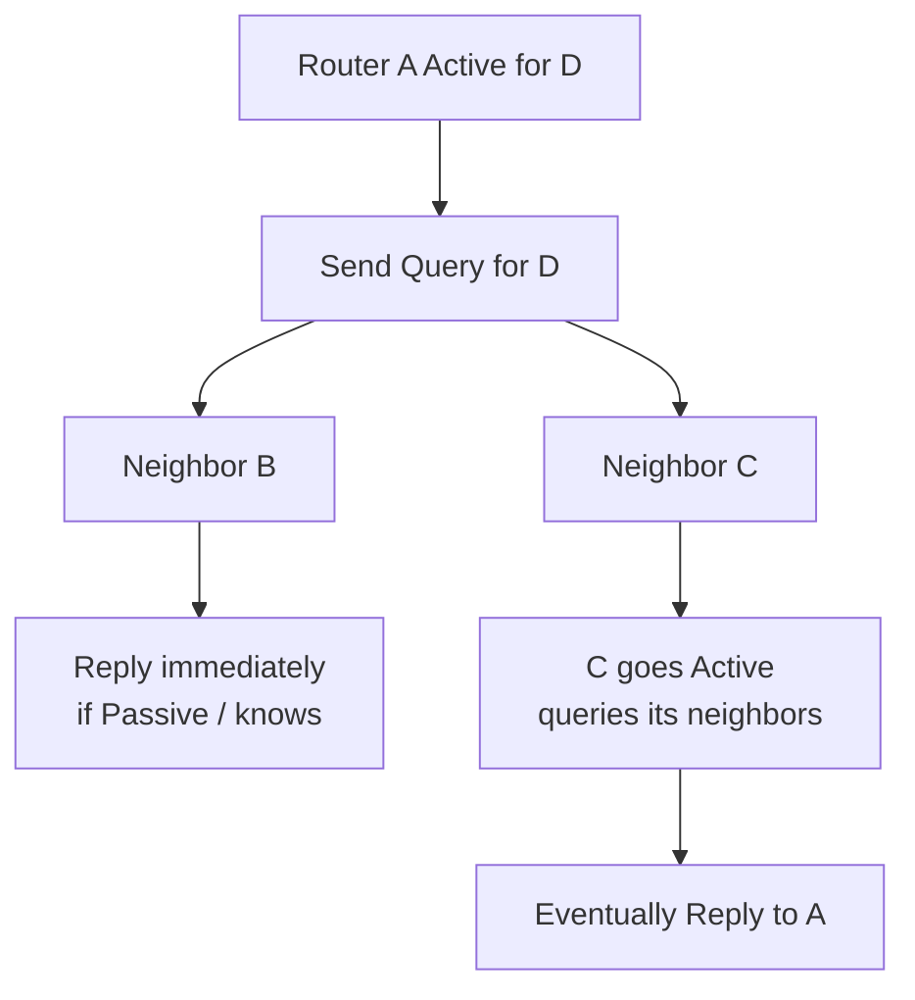

# Going Active and queries

When the successor is lost (or metric increases) and **no feasible successor** remains, DUAL places the destination in **Active** state and starts a **diffusing computation**.

## Active entry conditions

Typical triggers:

- Last successor interface/neighbor down; no FS.
- Successor metric increases; remaining neighbors fail FC against the applicable FD.
- Query received that forces recomputation (router may already be Active or join an ongoing diffusion).

While Active, the router **does not** install a new successor for that prefix until the computation finishes (replies collected or SIA logic intervenes).

## Query behavior

The Active router sends **Query** packets to neighbors (subject to split horizon / stub / filtering rules) asking for their current distance to the destination.

```text
Active router → Query(dest) → neighbors
neighbors → Reply(dest, metric or unreachable) → Active router
```

Neighbors that cannot answer immediately (they also go Active) will Query further—this is how the search **propagates** through the query domain.



## Stub and summary boundaries

- **EIGRP stub** routers do not propagate queries beyond themselves in the usual design (they reply that they are stub / do not query further)—critical for hub-spoke.
- **Summarization** boundaries stop more-specific queries from needing leaf detail beyond the summary edge (see module 09–10).

Without boundaries, a single leaf failure can Query across the entire AS.

## Configuration / observation

There is no “enable queries” knob—queries are inherent. Ops focus:

```text
show ip eigrp topology active
show ip eigrp topology 10.1.1.0/24
! Named:
show eigrp address-family ipv4 topology active
```

Lab: `debug eigrp packets query` / `debug eigrp fsm` (disruptive; use carefully).

## Risks

- Large Active sets → CPU and adjacency stress.
- Missing replies → path to SIA.
- Filtering that drops Queries/Replies asymmetrically creates black holes or SIA.

## Interview framing

“No FS → Active → Query neighbors → wait for Reply. Bound the query domain with stub and summary or you own SIA risk.”

## Related

- [Reply processing and new successor](07_Reply_Processing_and_New_Successor.md)
- [Query propagation](../09_Query_Scope_and_Convergence/01_Query_Propagation.md)
- [Stub as query boundary](../09_Query_Scope_and_Convergence/03_Stub_as_Query_Boundary.md)

---
