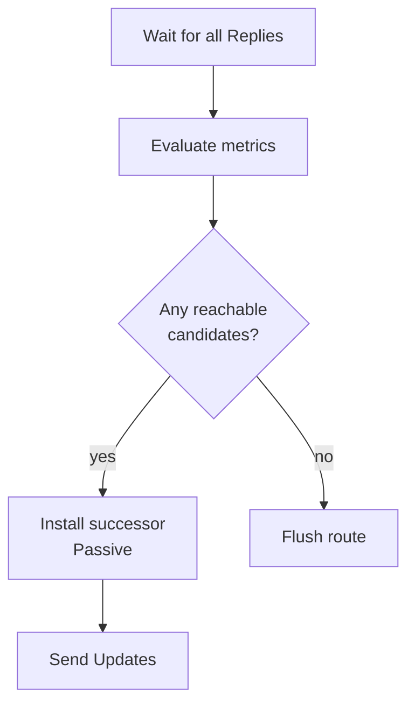

# Reply processing and new successor

An Active router finishes the diffusing computation when it has a **Reply** from every neighbor it queried (or SIA handling tears down stuck neighbors). Replies carry the neighbor’s distance to the destination or indicate unreachable.

## Reply contents (conceptual)

| Reply meaning | Effect on Active router |
|---|---|
| Reachable with metric M | Treat as candidate: local metric via that neighbor = link cost ⊕ M |
| Unreachable / infinite | That neighbor is not a viable next hop for this computation |
| Delayed (neighbor Active) | Neighbor will reply later after its own diffusion |

EIGRP uses reliable RTP delivery for Query/Reply; lost control packets are retransmitted until success or neighbor down.

## Selecting the new successor

When all outstanding replies are in:

1. Recompute local metrics for all responding neighbors.
2. Choose lowest metric loop-free path as new successor (FC applied in the new Passive context).
3. Update FD to the new successor metric.
4. Rebuild FS set (`RD <` new FD).
5. Transition prefix **Active → Passive**.
6. Send **Update** as needed so downstream neighbors learn the new metric/path.

If every reply is unreachable, the route is removed from the topology/RIB (destination unknown).



## Nested Active

If neighbor B receives A’s Query and B also lacks an FS, B goes Active, Queries its neighbors, and only then Replies to A. A’s timer runs across that whole subtree—why query scope design matters.

## Verification

```text
show ip eigrp topology active
show ip eigrp topology 172.16.0.0/16
show ip route 172.16.0.0
show ip eigrp neighbors detail
```

Watch Active count drop to zero after repair; confirm new `via` and FD.

## Failure modes during reply wait

- Neighbor crashes → treated as down; outstanding query to that neighbor clears.
- SIA timer expires → SIA-Query / neighbor reset (next lesson).
- One-way filtering of Replies → Active hangs until SIA.

## Interview framing

“Active ends when all replies return; then pick best metric path, set FD, return Passive, update neighbors. Nested Active is why a remote stub failure can delay your Reply.”

## Related

- [Going Active and queries](06_Going_Active_and_Queries.md)
- [How replies bound the computation](../09_Query_Scope_and_Convergence/02_How_Replies_Bound_the_Computation.md)
- [Stuck in Active](08_Stuck_in_Active.md)

---
