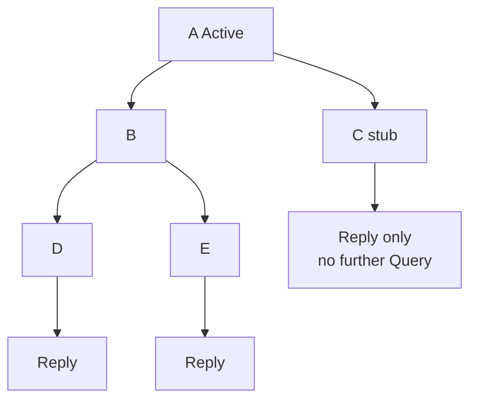

# Query propagation

When a router goes Active, **Queries** fan out to neighbors that might know an alternate path. The set of routers that may receive those Queries for a prefix is the **query domain** for that event.

## Propagation rules (practical)

1. Active router sends Query to eligible neighbors for the destination.
2. A neighbor that is **Passive** with an answer **Replies** (reachability + metric, or unreachable).
3. A neighbor that cannot satisfy the Query locally goes **Active** and Queries *its* neighbors—propagation continues.
4. **Stub** routers generally do not query further; they bound the domain.
5. At a **summary boundary**, queries for a component prefix often terminate because remote routers only know the summary (details in next lessons).
6. Split horizon / next-hop / filtering can suppress Query toward some interfaces.



## What expands the domain

- Flat topology, no stubs, no summaries.
- Redistribution injecting many specifics deep into the AS.
- Spokes configured as full EIGRP routers (non-stub) on multipoint clouds.
- Redundant meshes where every node is a transit.

## What shrinks the domain

- `eigrp stub` on access/spoke.
- Manual summarization at distribution layers.
- Hierarchical IP plan aligned to summary points.
- Fewer EIGRP hops between failure and knowledge of an alternate.

## Ops view

```text
show ip eigrp topology active
show ip eigrp neighbors
! Correlate Active prefixes with where the failure was
```

During a lab failure, traceroute-style thinking: “which routers went Active?” If core routers Active for a branch /32, the domain is too wide.

## Risks

Query storms amplify CPU and can induce SIA far from the failure. Treat unexplained core Active events as design defects.

## Interview framing

“Queries propagate until someone Replies without going Active, or a stub/summary boundary stops the search. Flat EIGRP AS = large query domain.”

## Related

- [Going Active and queries](../08_DUAL_and_Feasibility/06_Going_Active_and_Queries.md)
- [Stub as query boundary](03_Stub_as_Query_Boundary.md)
- [Summarization as query boundary](04_Summarization_as_Query_Boundary.md)

---
