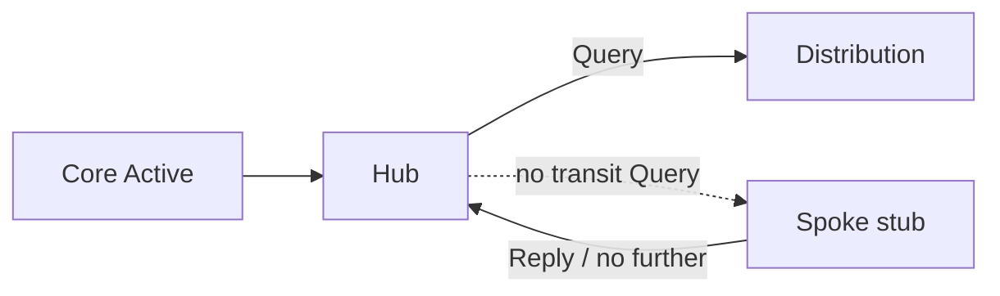

# Stub as query boundary

An **EIGRP stub** router advertises itself as stub to neighbors. Hubs use that signal to **avoid querying the stub** as a potential transit path for arbitrary destinations, and stub routers **do not propagate Queries** further. The spoke becomes a leaf of the query tree.

## Why spokes should be stub

In hub-and-spoke, a spoke rarely has useful alternate paths to remote enterprise prefixes via *other spokes* through the hub cloud in a way that justifies querying it. Without stub:

1. Hub goes Active for a prefix.
2. Hub Queries the spoke.
3. Spoke goes Active and may Query back toward the hub (or other hubs).
4. Query domain explodes; SIA risk rises.

With stub, the hub typically does not wait on spokes as transit solvers; spokes reply appropriately and do not extend the diffusion.



## Stub is not a substitute for filtering everything

Stub limits **query propagation** and restricts **which route types** the stub advertises (connected, summary, static, redistributed—per options). You still need summarization and sensible distribution lists for scale. Details: [Stub options](../11_Stub_Filtering_and_Split_Horizon/02_Stub_Options.md).

## Configuration (classic vs named)

```text
! Classic
router eigrp 100
 eigrp stub connected summary

! Named
router eigrp CORP
 address-family ipv4 unicast autonomous-system 100
  eigrp stub connected summary
 exit-address-family
```

Verify neighbors see stub:

```text
show ip eigrp neighbors detail
! "Stub Peer Advertising (CONNECTED SUMMARY) ..."
```

## Risks

- Stub with `receive-only` and no default/summary from hub → spoke black hole.
- Forgetting stub on new spokes reopens query domain silently.
- Using stub on a **transit** distribution router breaks alternate-path discovery—stub is for true edges.

## Interview framing

“Stub marks the router as a non-transit query leaf. Mandatory on classic hub-spoke spokes to prevent SIA; never stub a deliberate transit node.”

## Related

- [EIGRP stub overview](../11_Stub_Filtering_and_Split_Horizon/01_EIGRP_Stub_Overview.md)
- [Stub in hub and spoke](../11_Stub_Filtering_and_Split_Horizon/03_Stub_in_Hub_and_Spoke.md)
- [Designing the query domain](06_Designing_the_Query_Domain.md)

---
