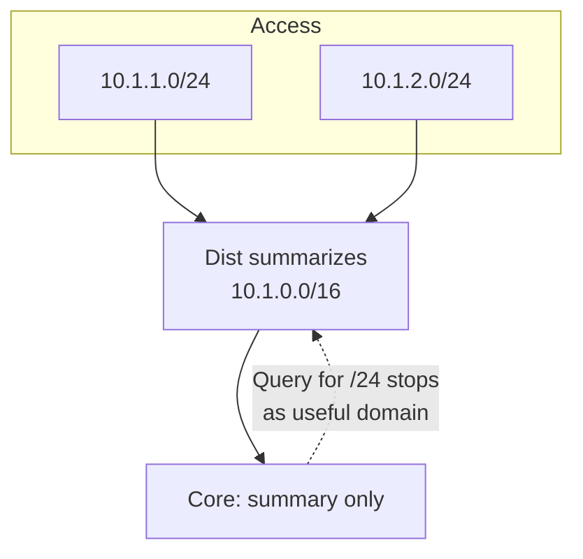

# Summarization as query boundary

**Summarization** shrinks both the routing table and the **query domain**. Routers beyond a summary edge often lack the component prefix; a Query for `10.1.1.0/24` reaching a router that only knows `10.1.0.0/16` tends to terminate with an unreachable (or non-expanding) Reply rather than flooding the entire /16 region looking for that /24.

## How the boundary works

```text
Access:  10.1.1.0/24, 10.1.2.0/24
Dist:    advertises 10.1.0.0/16 summary upstream
Core:    knows 10.1.0.0/16 only
```

If an access router loses `10.1.1.0/24` and goes Active:

- Queries toward the local access/dist region may still find an FS or alternate specific.
- Queries that hit routers with **only the summary** do not recurse through remote sites looking for `10.1.1.0/24` specifics that were never advertised there.

Exact platform behavior depends on topology and whether components exist elsewhere; the design intent is: **do not leak specifics past the summary plane**, so remote routers cannot be useful (or harmful) participants in that specific’s diffusion.



## Dual role of Null0

The summary’s **Null0 discard** prevents loops when a component is gone but the summary remains advertised upstream. That data-plane safety pairs with control-plane query containment. See [Null0 discard route](../10_Summarization/04_Null0_Discard_Route.md).

## Ops checks

```text
show ip route 10.1.0.0
show ip eigrp topology 10.1.0.0/16
show ip eigrp topology active
```

After a component failure, core should **not** show long-lived Active for that component if summarization is correct.

## Risks

- Over-summarizing without Null0 → loops to unrelated traffic.
- Leaking specifics past the boundary (leak-maps, redistribution) re-expands the query domain for those specifics.
- Discontiguous subnets inside a summary → black holes.

## Interview framing

“Summary boundaries hide specifics; remote routers cannot participate usefully in Queries for those specifics. Summarization is a query-scope tool, not only a table-size tool.”

## Related

- [Why summarize in EIGRP](../10_Summarization/01_Why_Summarize_in_EIGRP.md)
- [Summarization and query reduction](../10_Summarization/07_Summarization_and_Query_Reduction.md)
- [Stub as query boundary](03_Stub_as_Query_Boundary.md)

---
