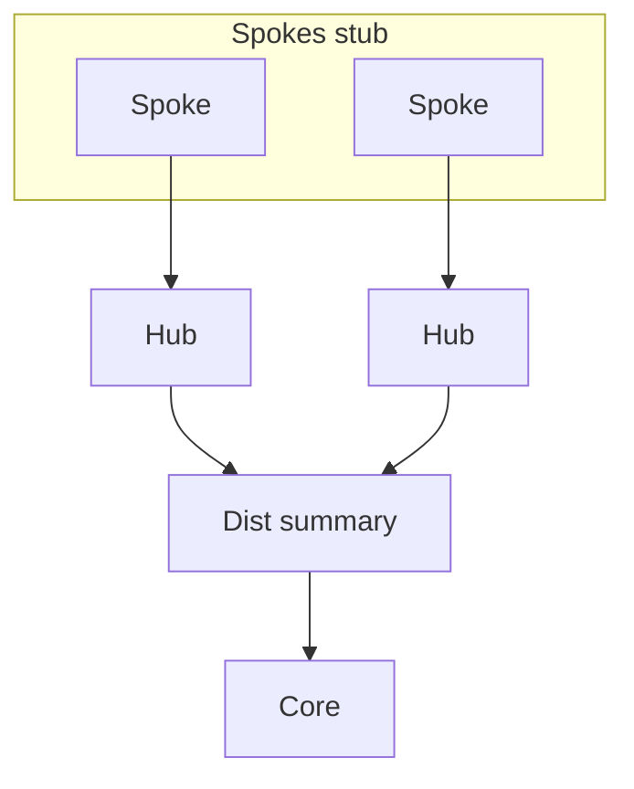

# Designing the query domain

Treat the EIGRP AS as a set of **failure domains** whose Active searches must not cross unnecessary boundaries. Query-domain design is addressing + topology + stub + summary working together.

## Reference patterns

### Hub-and-spoke WAN

- Spokes: `eigrp stub` (usually `connected summary`, plus static/redistributed if needed).
- Hub: non-stub; summarizes spoke ranges toward core where possible.
- Dual hubs: ensure spoke does not become transit between hubs; stub enforces that.
- Multipoint interfaces: mind split horizon for spoke-to-spoke through hub.

### Campus / three-tier

```text
Access  -- specifics -->  Distribution  -- summary -->  Core
```

- Summarize at distribution toward core.
- Do not stub distribution if it is transit between access blocks.
- Keep K-values identical; consistent bandwidth/delay policy.

### Dual-homed edge

- Prefer topologies where each edge router always has an FS via the other uplink.
- If not FC-eligible, expect Active; bound it so Active stays inside the pop.



## Addressing rules of thumb

1. Allocate contiguous space per site/region so one summary describes it.
2. Avoid discontiguous subnets inside a advertised summary.
3. Document leak-map exceptions—each leaked specific reopens a mini query domain.

## Checklist before production

- [ ] All true leaves stubbed
- [ ] Summary plan matches IP plan
- [ ] Null0 discard present for summaries
- [ ] No core Active in failure tests for access specifics
- [ ] SIA not observed under flap tests
- [ ] ACLs permit EIGRP where required

## Interview framing

“Draw where Queries are allowed to walk. Stub the leaves, summarize at hierarchy boundaries, and prove with Active traces that core stays Passive for access failures.”

## Related

- [Stub as query boundary](03_Stub_as_Query_Boundary.md)
- [Summarization as query boundary](04_Summarization_as_Query_Boundary.md)
- [Stuck in Active](../08_DUAL_and_Feasibility/08_Stuck_in_Active.md)

---
